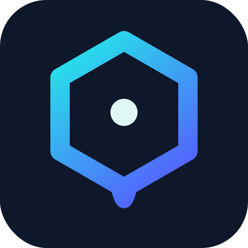

<!-- mcp-name: io.github.zoharbabin/web-researcher-mcp -->
<p align="center">
  
</p>
<h1 align="center">web-researcher-mcp</h1>
<p align="center">
  <strong>Your AI research assistant that cites real sources and stays honest.</strong>
</p>
<p align="center">
  Search the entire web or narrow it down to just the sites you trust;<br/>
  medical journals, court databases, news outlets, academic papers.<br/>
  Analyze the full source, not just snippets. Links that work, citations you can trust,<br/>
  no made up closed garden pre-synthesized results.
</p>

<p align="center">
  <a href="https://github.com/zoharbabin/web-researcher-mcp/actions/workflows/ci.yml"></a>
  <a href="https://goreportcard.com/report/github.com/zoharbabin/web-researcher-mcp"></a>
  <a href="https://pkg.go.dev/github.com/zoharbabin/web-researcher-mcp"></a>
  <a href="https://opensource.org/licenses/MIT"></a>
  <a href="https://github.com/zoharbabin/web-researcher-mcp/releases"></a>
  <a href="https://hub.docker.com/r/zoharbabin/web-researcher-mcp"></a>
  <a href="https://glama.ai/mcp/servers/zoharbabin/web-researcher-mcp"></a>
  <a href="https://github.com/zoharbabin/web-researcher-mcp/stargazers"></a>
</p>

### Get started in 30 seconds

**Python users — `uvx` (no compile, any OS):**
```bash
# One-time: install uv (skip if you already have it)
curl -LsSf https://astral.sh/uv/install.sh | sh        # macOS/Linux  (Windows: winget install astral-sh.uv)

claude mcp add --scope user web-researcher -- uvx web-researcher-mcp
```
[`uv`](https://docs.astral.sh/uv/) fetches the right prebuilt binary for your platform and runs it — no Go, no compile, no manual PATH. Point any MCP client at `uvx web-researcher-mcp`. Also works with `uv tool install web-researcher-mcp` or `pip install web-researcher-mcp`.

**macOS (Homebrew):**
```bash
brew install zoharbabin/tap/web-researcher-mcp
claude mcp add --scope user web-researcher -- web-researcher-mcp
```

**macOS / Linux (no package manager):**
```bash
curl -fsSL https://raw.githubusercontent.com/zoharbabin/web-researcher-mcp/main/install.sh | sh
```

**Windows (PowerShell):**
```powershell
powershell -ExecutionPolicy Bypass -c "irm https://raw.githubusercontent.com/zoharbabin/web-researcher-mcp/main/install.ps1 | iex"
```

No dev tools needed — every method ships the same signed binary (the PyPI wheels vendor it; the others download it and verify its checksum) and puts it on your PATH. The `curl`/PowerShell installers also register it with Claude Code automatically when the `claude` CLI is present; Homebrew installs the binary, so run the `claude mcp add` line above to connect it.

**One-click install:**

<p>
  <a href="https://cursor.com/en/install-mcp?name=web-researcher&config=eyJjb21tYW5kIjoidXZ4IiwiYXJncyI6WyJ3ZWItcmVzZWFyY2hlci1tY3AiXX0%3D"></a>
  <a href="https://vscode.dev/redirect?url=vscode%3Amcp%2Finstall%3F%257B%2522name%2522%253A%2522web-researcher%2522%252C%2522command%2522%253A%2522uvx%2522%252C%2522args%2522%253A%255B%2522web-researcher-mcp%2522%255D%257D"></a>
  <a href="https://lmstudio.ai/install-mcp?name=web-researcher&config=eyJjb21tYW5kIjoidXZ4IiwiYXJncyI6WyJ3ZWItcmVzZWFyY2hlci1tY3AiXX0%3D"></a>
</p>

The Cursor / VS Code / LM Studio buttons install the zero-config `uvx` setup (your editor prompts to confirm before adding it; needs [`uv`](https://docs.astral.sh/uv/) — see above). It runs **DuckDuckGo web search with no API key** — great to try instantly; `image_search`/`news_search` and richer providers need a key (2 min, see [Configuration](#configuration)). **Claude Desktop:** download the [`.mcpb` bundle](https://github.com/zoharbabin/web-researcher-mcp/releases/latest) for your platform and double-click it (Settings → Extensions), or use the `uvx` line above.

**Using a different MCP client** or want to pass API keys? See [Connect to Your AI Assistant](#connect-to-your-ai-assistant) for the per-app config, and [Configuration](#configuration) to pick a search provider.

Your AI can now search the web, read full articles, find academic papers, look up patents, and run multi-step research — only from sources you pick.

---

## Why does this exist?

Perplexity [gets its citations wrong over a third of the time](https://www.cjr.org/tow_center/we-compared-eight-ai-search-engines-theyre-all-bad-at-citing-news.php). It links to papers that don't exist, invents DOIs, and presents SEO spam with the same confidence as peer-reviewed research. ChatGPT's web search isn't much better — it can't tell a blog post from a court filing.

If your work gets cited, published, submitted to a court, or shown to a client — you can't afford "probably real" sources.

**This tool fixes the root cause:** instead of searching the entire web and hoping, you tell your AI *exactly which sources to search*. We call these "search lenses" — curated lists of trusted sites for each field.

| What you get | What that means for you |
|---|---|
| **Search lenses** — choose your sources by field | Your AI only sees the sites you trust (PubMed, SEC.gov, arXiv — not random blogs) |
| **Research tools for every source type** | Papers, patents, SEC filings, US court records, economic data, news, web pages, images, full-text reading, grounded answers with citations, structured extraction, and multi-step deep research |
| **Always has a backup** | Multiple search engines working together — if one has issues, the others pick up automatically |
| **Reads full articles** | Doesn't just give you snippets — extracts and reads entire pages, PDFs, Word docs, even YouTube transcripts |
| **Real citations, formatted** | Every source comes with a proper APA/MLA citation and a link that actually works |
| **Your queries stay private** | Runs on your machine — nobody sees what you're researching. Not us, not anyone. |
| **Paper trail** | Every search is logged so you can reproduce your research process months later |

Works with Claude, Claude Desktop, Cursor, and any AI assistant that supports tool use.

### Who uses this

- **Academic researchers** — "I need a literature review with real DOIs, not made-up citations"
- **Business analysts** — "My deliverable needs sources a client can actually click and verify"
- **Lawyers** — "If I cite a case that doesn't exist, I get fined $50,000"
- **Journalists** — "I need to cross-check government records and court filings, not Perplexity summaries"
- **Medical researchers** — "Clinical decisions based on a health blog could hurt someone"
- **Graduate students** — "I spent 3 hours tracking down a citation my AI invented"
- **Enterprise teams** — "Our competitive research can't go through a third party's servers"

---


---

## How It Compares

|  | web-researcher-mcp | Perplexity | Scite.ai | Elicit |
|---|---|---|---|---|
| You pick which sources are searched | **Yes** (built-in + custom lenses) | No | No | No |
| Makes up citations | **Never** — every link is real | ~37% incorrect | Rare (journals only) | Rare |
| Works across all fields | **Yes** — legal, medical, news, patents, everything | Yes | Journals only | Papers only |
| Keeps your research private | **Yes** — runs on your machine | No (they see everything) | No | No |
| Works inside your existing AI (Claude, Cursor, etc.) | **Yes** | No (separate app) | Partially | No (separate app) |
| Can read full articles, not just snippets | **Yes** — pages, PDFs, Word docs, YouTube | No | No | Limited |
| Cost | **Free forever** (open source) | $20/mo | $20/mo | $10-49/mo |

### When to use what

- **Perplexity** — Quick casual lookups where you don't need to cite your sources
- **Scite.ai / Elicit** — Browsing a specific database of academic papers
- **web-researcher-mcp** — Anything where your reputation is attached to the research: client work, court filings, publications, grant proposals, medical decisions, journalism
- **Claude built-in search** — Quick one-off lookups mid-conversation

---

## What your AI can do with this

| Tool | What it does |
|------|-------------|
| `web_search` | Search the web — optionally restricted to only the sources you trust via lenses |
| `scrape_page` | Read any URL in full — web pages, PDFs, Word docs, slideshows, YouTube transcripts; supports `mode: raw` for verbatim, unsanitized source (e.g. inspecting JSON or HTML) |
| `search_and_scrape` | Search and then read the best results — with quality scoring to surface the most reliable sources |
| `image_search` | Find images by size, type, color, or format |
| `news_search` | Search recent news with date controls and source filtering |
| `academic_search` | Find real papers with real DOIs — authors, citation counts, open-access links |
| `citation_graph` | Walk a paper's citation neighborhood — works it cites and works that cite it, with intent/influence signals |
| `patent_search` | Search patent offices (US, Europe, international) with classification codes |
| `filing_search` | Search SEC EDGAR for US public-company filings (10-K, 10-Q, 8-K, …) — or pull structured XBRL company facts |
| `legal_search` | Search US court opinions and dockets via CourtListener — real cases with real citations |
| `econ_search` | Look up economic data — World Bank global development indicators (keyless) and FRED US macro series (GDP, CPI, unemployment, rates) |
| `clinical_search` | Search ClinicalTrials.gov — clinical-trial registrations with status, phase, sponsor, and whether results are posted (discovery, not medical advice) |
| `verify_citation` | Check a citation before you rely on it — does it exist, match a real record, and is it retracted or a dead link? Evidence, not a verdict |
| `audit_bibliography` | Audit a whole reference list in one pass — paste a CSL-JSON/RIS/BibTeX file (or a session) and get per-entry + corpus-level flags for retracted, dead-link, and unverifiable citations |
| `archive_source` | Capture a fresh Internet Archive (Wayback Machine) snapshot of a URL via Save Page Now so a cited source stays verifiable if the page later changes or disappears — returns snapshot URL + timestamp (write tool) |
| `answer` | Ask a factual question and get one synthesized answer **with citations** — the direct answer, not a reading list |
| `structured_search` | Search and extract structured JSON per result (supply a schema), or pull entities by category (company, people, …) |
| `sequential_search` | Multi-step deep research — your AI remembers what it already found and builds on it |
| `get_research_session` | Recover a research session after context loss — picks up right where you left off |
| `research_export` | Export a research session as a shareable report (markdown or JSON), with full per-step provenance |
| `format_bibliography` | Turn collected sources into a formatted bibliography — APA, MLA, BibTeX, RIS, or CSL-JSON (Zotero/EndNote/Mendeley-ready) |

Most tools above are always available. A few activate only when the right provider or config is present: `citation_graph` requires a citation-capable academic provider (OpenAlex or Semantic Scholar); `filing_search` requires `EDGAR_CONTACT_EMAIL`; `answer` and `structured_search` require a provider that supports those capabilities (e.g. Exa). Operators can also enable opt-in, consent-gated tools (per-user analytics, long-term memory, shared workspaces) that appear only when their feature is turned on — see [`docs/TOOLS.md`](docs/TOOLS.md) for the authoritative, CI-verified tool list and full schemas.

### Ready-made research templates

The server also ships guided **prompt templates** your AI assistant can pull in with one click — they walk it through a proven, multi-step process so you don't have to spell out every instruction:

| Template | What it guides your AI to do |
|----------|------------------------------|
| `comprehensive-research` | Run a structured, multi-step deep dive on a topic |
| `fact-check` | Verify a claim against multiple independent sources |
| `competitive-analysis` | Size up a company and its market (news, patents, web) |
| `literature-review` | Systematically review academic literature on a topic |

In most AI apps these show up wherever you pick a prompt or "/" command. The server exposes live **status resources** (`stats://tools`, `stats://sessions`, `stats://rate-limits`, `stats://providers`), a lens catalog (`lenses://catalog`), diagnostics (`diagnostics://errors/recent`, `diagnostics://health`), and a large-payload artifact store (`research://artifact/{id}`) so you — or your AI — can check usage, limits, and which providers are active. See [docs/DEPLOYMENT.md](docs/DEPLOYMENT.md#mcp-resources--prompts) for the full list.

---

## Quick Start

### Option 1: Homebrew (macOS / Linux — recommended)

```bash
brew install zoharbabin/tap/web-researcher-mcp
claude mcp add --scope user web-researcher -- web-researcher-mcp
```

Homebrew handles trust, updates, and PATH for you — no signing warnings.

### Option 2: One-command install (any OS — no dev tools needed)

**macOS / Linux:**
```bash
curl -fsSL https://raw.githubusercontent.com/zoharbabin/web-researcher-mcp/main/install.sh | sh
```

**Windows (PowerShell):**
```powershell
powershell -ExecutionPolicy Bypass -c "irm https://raw.githubusercontent.com/zoharbabin/web-researcher-mcp/main/install.ps1 | iex"
```

Downloads the binary, verifies its SHA-256 checksum against the signed release, puts it on your PATH, and registers it with Claude Code if installed. Customize the install location:

```bash
INSTALL_DIR=/opt/tools curl -fsSL https://raw.githubusercontent.com/zoharbabin/web-researcher-mcp/main/install.sh | sh
```

<details>
<summary><strong>Other install methods</strong></summary>

**Scoop (Windows):**
```powershell
scoop bucket add zoharbabin https://github.com/zoharbabin/scoop-bucket
scoop install web-researcher-mcp
```

**Homebrew Cask (macOS — Developer ID-signed + notarized binary):**
```bash
brew install --cask zoharbabin/tap/web-researcher-mcp
```
The cask ships the notarized darwin binary (Gatekeeper-clean). Most users want the formula above (`brew install zoharbabin/tap/web-researcher-mcp`), which the bare name resolves to; pass `--cask` explicitly for the notarized artifact.

**Go install** (if you have Go):
```bash
go install github.com/zoharbabin/web-researcher-mcp/cmd/web-researcher-mcp@latest
claude mcp add --scope user web-researcher -- web-researcher-mcp
```

**Docker:**
```bash
# STDIO mode needs -i so the container's stdin stays attached for MCP JSON-RPC
docker run -i --rm \
           -e GOOGLE_CUSTOM_SEARCH_API_KEY=YOUR_KEY \
           -e GOOGLE_CUSTOM_SEARCH_ID=YOUR_CX \
           docker.io/zoharbabin/web-researcher-mcp:latest
```

**Build from source:**
```bash
git clone https://github.com/zoharbabin/web-researcher-mcp.git
cd web-researcher-mcp
go build -o web-researcher-mcp ./cmd/web-researcher-mcp
```

</details>

### Connect to Your AI Assistant

The install script registers with Claude Code automatically. For other apps, add to your AI's config file:

```json
{
  "mcpServers": {
    "web-researcher": {
      "command": "web-researcher-mcp",
      "env": {
        "GOOGLE_CUSTOM_SEARCH_API_KEY": "YOUR_GOOGLE_API_KEY",
        "GOOGLE_CUSTOM_SEARCH_ID": "YOUR_SEARCH_ENGINE_ID"
      }
    }
  }
}
```

Any provider works — pick one and set its key. For example, Brave (no Google keys needed):

```json
{
  "mcpServers": {
    "web-researcher": {
      "command": "web-researcher-mcp",
      "env": {
        "SEARCH_PROVIDER": "brave",
        "BRAVE_API_KEY": "YOUR_BRAVE_API_KEY"
      }
    }
  }
}
```

Swap in any provider from the [Configuration](#configuration) table by setting `SEARCH_PROVIDER` and that provider's key. Done — your AI assistant now has access to all research tools.

---

## Configuration

**No API key required.** DuckDuckGo is the built-in zero-config fallback — install and go. To raise result quality and unlock image/news search, add **any one** of the providers below. They're all optional and interchangeable — pick whichever you already use or prefer; the server treats them equally.

### Search providers

Set `SEARCH_PROVIDER=<name>` and supply that provider's key. Every provider works with [search lenses](#search-lenses), and any of them can be combined for automatic failover (see [Search Providers](#search-providers)).

| Provider | `SEARCH_PROVIDER` | Key variable(s) | Get a key |
|----------|-------------------|-----------------|-----------|
| DuckDuckGo | `duckduckgo` | none | Built in — zero config |
| Google PSE | `google` | `GOOGLE_CUSTOM_SEARCH_API_KEY` + `GOOGLE_CUSTOM_SEARCH_ID` | [cloud console](https://console.cloud.google.com/) + [engine](https://programmablesearchengine.google.com/) |
| Brave | `brave` | `BRAVE_API_KEY` | [brave.com/search/api](https://brave.com/search/api/) |
| Serper | `serper` | `SERPER_API_KEY` | [serper.dev](https://serper.dev/) |
| SearchAPI.io | `searchapi` | `SEARCHAPI_API_KEY` | [searchapi.io](https://www.searchapi.io/) |
| SearXNG | `searxng` | `SEARXNG_URL` | [self-hosted](https://docs.searxng.org/) |
| Tavily | `tavily` | `TAVILY_API_KEY` | [app.tavily.com](https://app.tavily.com/) |
| Exa | `exa` | `EXA_API_KEY` | [dashboard.exa.ai](https://dashboard.exa.ai/) |

> Each provider has its own free tier, signup flow, and capability mix (images, news, freshness). See **[docs/API_SETUP.md](docs/API_SETUP.md)** for step-by-step setup of every provider and a capability comparison. Set up more than one and the server fails over automatically — see [Search Providers](#search-providers).

When `SEARCH_PROVIDER` is unset, the server uses Google if its keys are present and otherwise falls back to the zero-config DuckDuckGo provider — so it always works out of the box, with or without keys.

### Academic Search (Optional — no signup needed)

| Variable | What to put | Why |
|----------|-------------|-----|
| `OPENALEX_EMAIL` | Your email address | Unlocks faster access to OpenAlex's full catalog of scholarly works — no registration, just an email |
| `CROSSREF_EMAIL` | Your email address | Same — faster access to DOI metadata for citations |

> With these set, `academic_search` returns real papers with DOIs, authors, citation counts, and open-access PDF links. Without them, it still works but uses web search as a fallback.

### Patent Search (Optional)

| Variable | What it is | Where to get it |
|----------|-------------|-----------|
| `EPO_OPS_CONSUMER_KEY` | European Patent Office key | [developers.epo.org](https://developers.epo.org) (free) |
| `EPO_OPS_CONSUMER_SECRET` | EPO secret | Same as above |
| `USPTO_API_KEY` | US patent office key | [developer.uspto.gov](https://developer.uspto.gov) (free) |
| `LENS_API_TOKEN` | The Lens (patents + scholarly) | [lens.org](https://www.lens.org) |

> With these, `patent_search` returns structured patent data with classification codes, dates, and inventors. Without them, it falls back to web search.

<details>
<summary><strong>Advanced: HTTP mode, OAuth, and all other settings</strong></summary>

| Variable | Description | Default |
|----------|-------------|---------|
| `PORT` | Run as a web server (for team/shared setups) | Off (runs locally) |
| `OAUTH_ISSUER_URL` | Authentication server URL (for team access control) | |
| `OAUTH_AUDIENCE` | Expected audience claim | |

See [docs/DEPLOYMENT.md](docs/DEPLOYMENT.md#environment-variables) for the complete list of all settings (cache, rate limiting, scraping, observability, etc.).

</details>

---

## Under the Hood

<details>
<summary><strong>Architecture (for developers and contributors)</strong></summary>

```
web-researcher-mcp/
├── cmd/web-researcher-mcp/     # Entry point (wiring only)
├── internal/
│   ├── config/                 # Env-based strongly-typed configuration
│   ├── server/                 # MCP server lifecycle + signal handling
│   ├── tools/                  # Tool handlers (one file per tool)
│   ├── search/                 # Pluggable search providers + router + lens routing
│   ├── scraper/                # Tiered scraping pipeline (markdown → stealth → HTML → browser; + optional paid Exa tier)
│   ├── documents/              # PDF, DOCX, PPTX parsing
│   ├── cache/                  # Hybrid cache (memory + AES-encrypted disk)
│   ├── auth/                   # OAuth 2.1 middleware + JWKS
│   ├── audit/                  # Structured audit logging
│   ├── session/                # Per-tenant session persistence (memory index + encrypted disk)
│   ├── content/                # Sanitize, dedup, truncate, quality score
│   ├── metrics/                # Prometheus metrics + per-tool stats
│   ├── ratelimit/              # Three-tier rate limiting
│   ├── circuit/                # Circuit breaker for external APIs
│   ├── persist/                # TTL key/value store (memory or encrypted disk) for token revocation + rate quotas
│   └── resources/              # MCP Resources + Prompts
├── lenses/                     # Search lens JSON files
└── docs/                       # Extended documentation
```

<details>
<summary><strong>High-Level Architecture Diagram</strong></summary>

The full layered diagram (MCP transports → tool dispatch → service layer → infrastructure) and the per-package map live in **[ARCHITECTURE.md](ARCHITECTURE.md)** — kept in one place to avoid drift.

</details>

<details>
<summary><strong>Design Principles (for developers)</strong></summary>

1. **Zero global state** -- all dependencies injected via constructors
2. **Interface-driven** -- every external dependency behind an interface for testing and swapping
3. **Bounded concurrency** -- explicit semaphores for external API calls
4. **Defense in depth** -- SSRF protection, rate limiting, content sanitization at every layer
5. **Fail loud** -- errors returned, never swallowed; validation at boundaries

</details>

</details>

---

## Search Providers

You choose which search engine powers your research. All of them work with lenses.

| Provider | Whole-Web | Images | News | Notes |
|----------|:---------:|:------:|:----:|-------|
| **DuckDuckGo** | Yes | — | — | Zero-config default (no API key needed); rate-limited for heavy use |
| **Google PSE** | Yes | Yes | Yes | Programmable Search Engine; free tier: 100 queries/day |
| **Brave Search** | Yes | Yes | Yes | Independent index; free tier available |
| **Serper.dev** | Yes | Yes | Yes | Google-identical results |
| **SearXNG** | Yes | Yes | Yes | Self-hosted, privacy-first, air-gapped deployments |
| **SearchAPI.io** | Yes | Yes | Yes | Unified API with multiple engine backends |
| **Tavily** | Yes | — | Yes | AI-agent search; clean, LLM-ready content |
| **Exa** | Yes | — | Yes | Neural/semantic search; also backs `answer` & `structured_search` and the optional paid scrape tier |

### Multiple Providers (recommended)

Set up multiple search engines so if one has issues, your research doesn't stop:

```bash
export SEARCH_ROUTING=brave,google,serper
```

If Brave is down, it automatically tries Google. If Google is rate-limited, it falls through to Serper. Your research just works.

See [docs/DEPLOYMENT.md](docs/DEPLOYMENT.md#multi-provider-routing) for advanced routing options (per-topic routing, patent-specific providers, etc.).

### Single Provider

If you only have one search API key, that works too — just set it up and go.

<details>
<summary><strong>Provider Setup Examples</strong></summary>

**Multi-provider routing (recommended):**
```bash
export SEARCH_ROUTING=brave,google,serper
export BRAVE_API_KEY=BSAxxxxxxxxxx
export GOOGLE_CUSTOM_SEARCH_API_KEY=AIza...
export GOOGLE_CUSTOM_SEARCH_ID=017...
export SERPER_API_KEY=...
```

**Single provider — Brave Search:**
```bash
export SEARCH_PROVIDER=brave
export BRAVE_API_KEY=BSAxxxxxxxxxx
```

**Single provider — SearXNG (self-hosted, privacy-first):**
```bash
export SEARCH_PROVIDER=searxng
export SEARXNG_URL=http://localhost:8080
```

**Single provider — Exa (also unlocks the `answer` & `structured_search` tools):**
```bash
export SEARCH_PROVIDER=exa
export EXA_API_KEY=...
```

**Single provider — Google PSE:**
```bash
export SEARCH_PROVIDER=google
export GOOGLE_CUSTOM_SEARCH_API_KEY=AIza...
export GOOGLE_CUSTOM_SEARCH_ID=017...
```

Any provider from the [Configuration](#configuration) table works the same way — set `SEARCH_PROVIDER` and its key(s).

</details>

---

## Search Lenses

Search lenses let you control which websites your AI is allowed to search. Instead of searching the entire web (and getting blogs, spam, and AI-generated junk), a lens restricts results to only the sources you trust for that topic.

### Built-in Lenses

| Lens | Focus |
|------|-------|
| `docs` | Official documentation and API references only |
| `academic` | Preprint servers, repositories, open-access journals |
| `academic-extended` | Preprint servers, OA aggregators, and repositories beyond core journal indexes |
| `clinical` | Clinical trials, drug safety, evidence-based medicine |
| `security` | CVEs, advisories, vulnerability research |
| `journalism` | Public records, corporate filings, FOIA |
| `programming` | Code docs, tutorials, Q&A |
| `devops` | Infrastructure and operations — Kubernetes, Docker, Terraform, cloud, CI/CD |
| `news` | Current events, journalism |
| `tech` | Technology industry |
| `legal` | Law, cases, statutes |
| `medical` | Health, medicine |
| `finance` | Markets, filings |
| `science` | Research, papers |
| `government` | Policy, regulations |

You can also [create your own lenses](#search-lenses) for any field — just list the domains you trust.

### How it works

When you (or your AI) use a lens, results come only from the sites in that lens. For example, using the `medical` lens means your AI searches PubMed, WHO, NIH, and other clinical sources — never health blogs or supplement ads.

Your AI uses lenses automatically when you ask it to. For example: *"Search for recent findings on SGLT2 inhibitors using the clinical lens."*

<details>
<summary><strong>Creating Your Own Lens</strong></summary>

Add a JSON file to the `lenses/` directory with the sites you trust:

```json
{
  "name": "my-industry",
  "description": "Only searches sources I trust for my field",
  "domains": [
    "trusted-source.com",
    "industry-journal.org",
    "official-database.gov"
  ],
  "cx": "",
  "routing": ""
}
```

That's it. Now your AI will only search those sites when you use this lens. You can add up to ~10 domains per lens.

**Advanced options** (optional — most users can ignore these):
- **cx** — If you have a Google Programmable Search Engine with up to 5,000 domains, put the engine ID here
- **routing** — Force this lens to use a specific search provider (e.g., `"google"`)

</details>

---

## Privacy & Security

Your research queries go directly from your machine to the search provider you chose. They never pass through our servers (we don't have servers). The tool runs entirely on your computer.

<details>
<summary><strong>Technical security details (for enterprise / compliance teams)</strong></summary>

- **SSRF protection** — blocks internal network access, cloud metadata endpoints, DNS rebinding attacks
- **OAuth 2.1** (HTTP mode) — JWKS token validation, per-tenant isolation, audience/issuer validation
- **Rate limiting** (HTTP mode) — per-tenant + global limits to protect upstream APIs
- **Content sanitization** — HTML cleaned via whitelist policy, deduplication, quality scoring

For the full threat model, see [docs/SECURITY.md](docs/SECURITY.md).

</details>

---

## Setup for Each AI App

### Claude Code

Add to your MCP config (`~/.claude.json`). Set `SEARCH_PROVIDER` and the matching key for whichever provider you use (see the [Configuration](#configuration) table) — this example uses Google:

```json
{
  "mcpServers": {
    "web-researcher": {
      "command": "/path/to/web-researcher-mcp",
      "env": {
        "SEARCH_PROVIDER": "google",
        "GOOGLE_CUSTOM_SEARCH_API_KEY": "AIza...",
        "GOOGLE_CUSTOM_SEARCH_ID": "017..."
      }
    }
  }
}
```

### Claude Desktop

Add to `~/Library/Application Support/Claude/claude_desktop_config.json` (macOS) or `%APPDATA%\Claude\claude_desktop_config.json` (Windows):

```json
{
  "mcpServers": {
    "web-researcher": {
      "command": "/path/to/web-researcher-mcp",
      "env": {
        "GOOGLE_CUSTOM_SEARCH_API_KEY": "AIza...",
        "GOOGLE_CUSTOM_SEARCH_ID": "017..."
      }
    }
  }
}
```

### Cursor

Add to `.cursor/mcp.json` in your project root:

```json
{
  "mcpServers": {
    "web-researcher": {
      "command": "/path/to/web-researcher-mcp",
      "env": {
        "GOOGLE_CUSTOM_SEARCH_API_KEY": "AIza...",
        "GOOGLE_CUSTOM_SEARCH_ID": "017..."
      }
    }
  }
}
```

### HTTP Mode (Teams / Shared Server)

For teams that want one shared instance everyone connects to:

```bash
PORT=3000 \
OAUTH_ISSUER_URL=https://auth.example.com \
OAUTH_AUDIENCE=https://api.example.com \
./web-researcher-mcp
```

Then connect any AI app to `http://localhost:3000/mcp/`.

<details>
<summary><strong>Docker Compose Example</strong></summary>

```yaml
services:
  web-researcher:
    image: zoharbabin/web-researcher-mcp
    ports:
      - "3000:3000"
    environment:
      PORT: "3000"
      SEARCH_PROVIDER: brave
      BRAVE_API_KEY: ${BRAVE_API_KEY}
```

</details>

> **Note:** Tool behavior is identical across all connection modes (STDIO and HTTP). The only differences are auth (HTTP requires OAuth) and rate limiting (HTTP enforces per-tenant limits; STDIO has only upstream API quotas). See [docs/DEPLOYMENT.md](docs/DEPLOYMENT.md) for details.

---

## Performance

Searches come back in under a second. Previously-seen results are cached so repeats are instant. Full article extraction works on 95%+ of the web — including sites that try to block bots. Heavy JavaScript sites get a real browser behind the scenes (automatic, no setup needed).

---

## Development

```bash
go build -o web-researcher-mcp ./cmd/web-researcher-mcp   # Build
go test -race ./...                                        # Test (with race detector)
make verify                                                # Full gate: fmt, vet, lint, gosec, govulncheck, tests, E2E, build
```

The lint, gosec, and govulncheck tools are pinned as `go.mod` tool directives, so `make verify` runs them at the exact versions CI uses (no global installs needed). Branch protection requires the Lint, Test, Security, and E2E checks to pass.

See [CONTRIBUTING.md](CONTRIBUTING.md) for the full development workflow, code style guide, and PR process.

---

## Troubleshooting

<details>
<summary><strong>Server starts but tools fail with "API key" errors</strong></summary>

The server starts even with missing credentials (to allow MCP handshake). Set your API keys in the `env` block of your MCP client config, not in your shell profile.

</details>

<details>
<summary><strong>Some pages come back empty</strong></summary>

For JavaScript-heavy sites, the tool uses a real browser (Chromium). With the binary install it auto-downloads on first use (~200MB). If you already have Chrome installed, set `CHROME_PATH` to point to it. The Docker image ships with Chromium bundled (`CHROME_PATH` preset), so JavaScript rendering works out of the box — no download.

</details>

<details>
<summary><strong>Cache serving stale results after upgrade</strong></summary>

The disk cache lives at your OS cache directory (e.g., `~/Library/Caches/web-researcher-mcp/` on macOS, `~/.cache/web-researcher-mcp/` on Linux). Delete that directory to clear it, or set `CACHE_DIR` to a custom path.

</details>

<details>
<summary><strong>Hitting search limits (429 errors)</strong></summary>

If your provider's free tier runs out (e.g. Google PSE allows 100 searches/day):
- Switch to a different provider — set `SEARCH_PROVIDER` to any other option (see [Configuration](#configuration)); each has its own free tier
- Set up multiple providers (e.g. `SEARCH_ROUTING=brave,google`) — if one is rate-limited, it automatically falls through to the next
- Or upgrade your provider's plan

</details>

<details>
<summary><strong>macOS: "Failed to reconnect" / error -32000 after a manual update</strong></summary>

This happens only if you replaced the binary by copying new bytes *over* the existing file in place (`cp new /path/to/web-researcher-mcp`). On Apple Silicon, macOS caches the binary's ad-hoc code signature against the file, and overwriting it in place can make the next launch get killed before it starts. The official installers (Homebrew, the one-command `install.sh`, and the Claude Code plugin) avoid this by installing to a fresh file. To fix a manual install, replace it cleanly and re-sign:

```bash
rm -f /path/to/web-researcher-mcp
cp /path/to/new-build /path/to/web-researcher-mcp
codesign --force -s - /path/to/web-researcher-mcp   # ad-hoc re-sign
```

Then reconnect your client. (Re-running `install.sh` does this correctly for you.)

</details>

---

## Contributing

Contributions are welcome. Please see [CONTRIBUTING.md](CONTRIBUTING.md) for code style guidelines, development workflow, and how to submit pull requests.

---

## Documentation

| Document | Description |
|----------|-------------|
| [ARCHITECTURE.md](ARCHITECTURE.md) | Design decisions, technology stack, dependencies |
| [CONTRIBUTING.md](CONTRIBUTING.md) | Development setup, code style, PR workflow |
| [docs/TOOLS.md](docs/TOOLS.md) | Tool specifications and parameter schemas |
| [docs/EXAMPLES.md](docs/EXAMPLES.md) | Usage examples with JSON tool calls |
| [docs/API_SETUP.md](docs/API_SETUP.md) | Search provider API key setup for all providers |
| [docs/SECURITY.md](docs/SECURITY.md) | Threat model, SSRF, auth, compliance (SOC2/GDPR/FedRAMP) |
| [docs/PRIVACY.md](docs/PRIVACY.md) | What data goes where, third-party processors, retention |
| [docs/DEPLOYMENT.md](docs/DEPLOYMENT.md) | Build, Docker, Kubernetes, client configs, scaling |
| [docs/LESSONS_LEARNED.md](docs/LESSONS_LEARNED.md) | Node.js to Go migration story and lessons |
| [docs/SESSION_PERSISTENCE.md](docs/SESSION_PERSISTENCE.md) | How sessions survive context loss — design, data flow, citations |
| [docs/MIGRATION.md](docs/MIGRATION.md) | Migrating from the deprecated google-researcher-mcp |

---

## License

[MIT](LICENSE)

---

## Star History

[](https://www.star-history.com/?repos=zoharbabin%2Fweb-researcher-mcp&type=date&legend=top-left)

---

<p align="center">
  Built with <a href="https://go.dev">Go</a> and the <a href="https://modelcontextprotocol.io/">Model Context Protocol</a>
  <br/><br/>
  If you're tired of AI making things up, give this a try — and a ⭐ if it helps.
</p>
