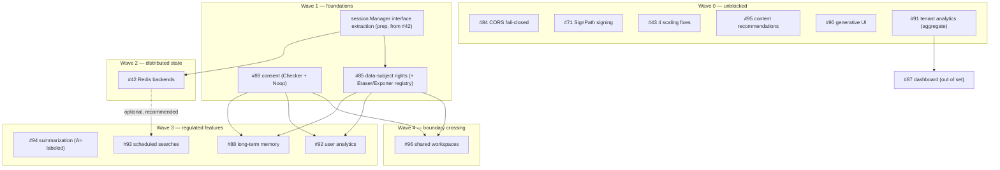

# Round 2 — Master Implementation Workflow

The single source of truth for implementing, verifying, testing, documenting, and packaging the 14 Round 2 issues to 100% quality, KISS, and future-proof architecture. Every issue ships only after the quality gates in Section 6 are green.

This document reconciles three expert cross-cutting reviews (architecture, security/compliance, QA/packaging) into the per-issue specs. Where a review corrected a dependency edge, a KISS scope, or a must-fix-before-start item, the correction is applied below and is authoritative.

## 0. As-Built Status

All waves are implemented on branch `round2/implementation`. The plan below is the design rationale; this section records what actually shipped and the decisions applied.

| Issue | Status | Notes |
|---|---|---|
| #84 CORS fail-closed | ✅ Shipped | Minor-release breaking change + escape hatch + browser-client doc |
| #4 admin key rename | ✅ Shipped | `CACHE_ADMIN_KEY` → **`ADMIN_API_KEY`** (legacy accepted w/ deprecation warning) + key-rotation docs |
| #43 scaling fixes | ✅ Shipped | Typed `session_not_found` + `PodID` + readiness checklist; Cache-Control stays `no-store` |
| #95 recommendations | ✅ Shipped | Default on; content-only, no model |
| #90 generative UI | ✅ Shipped | Default off; label renamed **`mcp-auto-formatted`** (no AI involved — deterministic) |
| #91 tenant analytics | ✅ Shipped | `/admin/analytics`, aggregate-only |
| session.Manager interface | ✅ Shipped | Pure refactor (`MemoryManager` + interface) |
| #89 consent | ✅ Shipped | Record-verify-honor (host asserts, server verifies/records/honors); fail-closed; Noop default; activates from feature flags (no orphan `CONSENT_ENABLED`) |
| #85 data-subject rights | ✅ Shipped | `(tenantID,userID)` Exporter/Eraser registry; `/admin/data` GET+DELETE; erasure withdraws consent |
| #42 Redis | ✅ Shipped | Iron-clad isolation: `internal/redisbackend` is the sole go-redis importer; one gated construction; fail-fast; encryption-mandatory; miniredis tests |
| #92 user analytics | ✅ Shipped | Consent-gated; `get_my_analytics`; registered in #85 |
| #88 long-term memory | ✅ Shipped | Consent-gated; `memory_save`/`memory_recall`; retention TTL; forget via #85 erasure (no `memory_forget`) |
| #96 shared workspaces | ✅ Shipped (reframed) | Host owns membership, server enforces data-plane + isolation; non-member-zero-bytes gate |
| #93 scheduling | ❌ Closed (won't-do) | Scheduling is a host responsibility (MCP spec + Anthropic/OpenAI both schedule host-side) |
| #94 summarization | ❌ Closed (won't-do) | No second LLM in the MCP; clients are already LLMs |
| #71 SignPath | ⏳ External | Gate wiring verified; blocked only on Foundation cert assignment |

**Decisions applied** (from Section 8 + research): `(tenantID,userID)` erasure from day one; **#89 hybrid** (host obtains consent per MCP spec, server records/verifies/honors — research-confirmed); typed purpose constants; single renamed `ADMIN_API_KEY` + rotation tooling/docs; miniredis test-only (Lua `INCR`+`EXPIRE` verified); require encryption for personal namespaces on Redis; fail-fast on Redis connect; CORS minor release; recall+save first (forget → #85). #93/#94 closed and #96 reframed per the MCP-standards research (see the round2-decision-research briefs).

## 1. Executive Summary

The 14 issues split into **enablers** and **dependents**. The through-line is: do not ship personal data without rights + consent coverage, and do not invent a parallel storage/crypto/telemetry path when an interface seam already exists.

Three foundations gate everything regulated:

1. **Distributed-state abstraction (#42)** — `persist.Store` is already the durable key/value seam; `cache.Cache` is already an interface. The real work is extracting a `session.Manager` interface and adding an optional `persist.Incrementer`, then dropping in Redis implementations behind those seams. Once landed, sessions / rate-limit daily quota / cache scale horizontally with zero caller changes. Memory (#88), analytics (#92), scheduler (#93), workspaces (#96) all inherit distribution for free by building on `persist.Store`.
2. **Data-subject rights (#85)** — must define a pluggable `(tenantID, userID)`-keyed **Exporter/Eraser registry** (not a session-only hardcode). Every personal-data store registers into it so a single export/erasure request enumerates all namespaces. Without this, a regulated feature can persist per-user data that erasure silently misses.
3. **Consent (#89)** — must expose a read-side `consent.Checker` (`HasConsent(ctx, purpose) bool`) plus a typed purpose enum, defaulting to a `consent.Noop` so disabled is a byte-for-byte no-op. Every regulated write checks consent before persisting.

Everything sequences off these. Unblocked hardening and additive-output features ship first (Wave 0). The interface-extraction refactor and the two compliance foundations land next (Wave 1). Redis (#42) follows over the now-stable interfaces (Wave 2). Consent/erasure-gated features (#88, #92, #94) come after the foundations are merged with concrete interfaces (Wave 3). Shared workspaces (#96) — the only feature that deliberately crosses the tenant boundary — ships last (Wave 4).

A handful of human decisions block the start of specific issues; they are consolidated in Section 8.

## 2. Dependency DAG

Edges reflect the **reconciled** graph after applying the reviews' dependency corrections:

- The circular `#42 ↔ #43` edge is removed. The four Redis-independent items in #43 depend on nothing; only #43's *deferred* distributed items need #42. This document covers only #43's four independent items.
- `#89 → #94` and `#89 → #95` are removed: summarization (#94) persists no per-user data, and recommendations (#95) is content-only/non-profiling. Both land independently.
- `#89 → #96` is added (workspaces need consent).
- `#88` prerequisites are `#85, #89` (the issue body's "#88 consent" is a typo for #89).
- `#42` exposes a standalone **session.Manager interface extraction** as a prep step that #85's new methods and the Redis manager both target.

Topologically-ordered build sequence (waves are the grouping; within a wave the order is as listed):

1. **Wave 0:** #71, #84, #43, #95, #90, #91 (independent; any order, but front-load #71 and #84).
2. **Wave 1:** session.Manager interface extraction → #89 → #85 (extraction first; #89 and #85 may run in parallel after it).
3. **Wave 2:** #42.
4. **Wave 3:** #94, #92, #88, #93 (#94 first; #93 may slot anywhere once unblocked).
5. **Wave 4:** #96.

## 3. Shared Abstractions to Build Once

This is the KISS core. Build each once, reuse many. Reject any PR that introduces a parallel path.

| Abstraction | Definition | Owned by | Consumed by | Rule |
|---|---|---|---|---|
| `persist.Store` durable KV | Existing `Get / Set(ttl) / Delete` interface; `MemoryStore` + AES-256-GCM `DiskStore` (8-byte expiry prefix, key-bound AAD, atomic temp+rename, prev-key rotation). | existing | #42, #85, #88, #89, #92, #93 | All new per-tenant/per-user state uses this. No bespoke encrypted file format. |
| `persist.Incrementer` | Optional `IncrBy(ctx, key, delta, ttl) (int64, bool)`; type-asserted by ratelimit for atomic cross-pod daily quota. Memory/disk stores do not implement it (fallback to current behavior). | #42 | #42 (ratelimit) | Daily quota only. Per-minute/per-IP buckets stay local. |
| `session.Manager` interface | Extracted from the concrete type's exact method set: `Create, AppendStep, SetResearchGoal, AddSources, GetIndex, GetFull, GetStep, Delete, DeleteAll, Close, ActiveCount` (verified against `internal/session/manager.go`). | extraction PR (from #42) | #42 (RedisManager), #85 (adds tenant methods to the interface), #88/#94/#96 (callers) | Land as a standalone refactor before #42's Redis impl and #85's new methods. |
| `consent.Checker` + purpose enum | Read-side `HasConsent(ctx, purpose string) bool` derived from `Query`, plus typed purpose constants (`memory`, `analytics`, `summarization`, `workspace`). `consent.Noop` default. | #89 | #88, #92, #96 | One interface, one enum. Consumers never invent purpose strings. |
| Data-subject **Exporter/Eraser registry** | `(tenantID, userID)`-keyed `DataExporter` / `DataEraser` interfaces that each store registers under its namespace; #85 enumerates all registered namespaces for one subject. Session eraser degrades to tenant scope (Session has no UserID — verified). | #85 | #85, #88, #92, #93, #96 | Erasure must reach every per-user namespace. Tenant-only v1 ships the registry seam so dependents wire in. |
| AES-256-GCM crypto helpers | `cache.NewGCM / GCMEncrypt / GCMDecrypt / PrependExpiryHeader`. | existing | #42, #88, #89, #92, #93, #96 | One AEAD, one AAD-binding discipline, one rotation path. No second crypto path. |
| Admin endpoint gate | `if cfg.AdminKey != "" { mux.Handle("<VERB> /admin/...", maxBytes(adminAuth(cfg.AdminKey, h))) }` with constant-time X-Admin-Key (verified `server.go:107-108`, `adminAuth` at `:290`). | existing | #85, #91, #96 | Reuse the existing `CacheAdminKey`. No per-feature admin keys. |
| Noop + main.go env-selection + `RegisterAll` gating | Mirror `audit.Noop`. Hot-path hooks (consent check, analytics `Record`) use a Noop for parity; registration-only features use `nil` + skip registration. | existing pattern | #88, #89, #90, #91, #92, #93, #94, #96 | Hot-path → Noop; tool-registration-only → nil. |
| `content.QualityScore` ranking signal | Already computed per source; the only content-derived ranking signal. | existing | #90, #95 | No new scoring pass, no behavioral input. Reason-string/component builders live in `internal/content` next to the scorer. |
| `auditToolCallQuery` / `audit.NewEvent` chokepoint | The single per-call instrumentation point. | existing | #43 (PodID), #91 (RecordTenantCall), #92 (analytics Record) | Sequence these three adjacently; instrument once. |
| `requireAuthenticatedUser(ctx)` helper | Rejects `userID == "anonymous"` (verified `auth/middleware.go:91`) for any user-scoped write. | #85/#89 foundation | #88, #92, #96 | One helper, used by all user-scoped writes. |
| AI-label envelope | Server-side Go constants (label + disclaimer) injected after the provider returns; `aiFormatted: true` on every component; resolvable `sourceRef`/`sources[]`. | #94/#90 | #94, #90 | Non-bypassable (EU AI Act Art. 50). Provider can never strip it. |
| Audit `EventType` naming | Dotted namespaces: `consent.grant`, `consent.withdraw`, `data.export`, `data.erasure`, `workspace.contribute`, `schedule.run`. Exported consts in the owning package, not inline literals. | convention | #85, #88, #89, #92, #93, #96 | One convention across all logs. |
| CI drift-gate convention | `setupTestDeps()` (`internal/tools/tools_test.go:74`) constructs the **full superset** of optional deps (mock Summarizer/Memory/Scheduler/Workspaces/Analytics) so every conditionally-registered tool is visible to `TestToolsDocMatchesRegistry` / `TestAllToolsHaveAnnotations` / `TestOutputSchemaMatchesResponse` and `docs/TOOLS.md` is verified. | convention | #88, #92, #93, #94, #96 | Documented in CONTRIBUTING. Each gated-tool spec edits `tools_test.go`. |

## 4. Per-Wave Plan

### Wave 0 — Unblocked hardening and additive output

- **Issues:** #71, #84, #43 (four independent items), #95, #90, #91.
- **Order:** #71 and #84 first (external/breaking, own clean releases), then #43, #95, #90, #91.
- **Shared abstraction landed:** the **CI drift-gate convention** (first declared here for #90/#95 output-schema keys); the **audit chokepoint** discipline (#43 PodID, #91 RecordTenantCall) is exercised but not yet shared with #92.
- **Exit gate:** `make verify` green on each; new e2e tests use the `TestHTTP_` prefix; #84 has a maintainer-approved release tag and updated MIGRATION; output-schema drift tests pass for #90/#95.

### Wave 1 — Interface foundations

- **Issues:** session.Manager interface extraction (prep) → #89 → #85.
- **Order:** extraction PR first (pure refactor, all tests green, no new dep). Then #89 and #85 in parallel.
- **Shared abstraction landed:** `session.Manager` interface; `consent.Checker` + purpose enum + `consent.Noop`; data-subject **Exporter/Eraser registry**; `requireAuthenticatedUser(ctx)`.
- **Exit gate:** extraction PR keeps `go build ./... && go test -race ./...` green with zero behavior change; #89 exports the concrete Checker interface and typed purposes; #85 ships the registry seam with session + consent namespaces registered; single admin key confirmed reused.

### Wave 2 — Distributed state

- **Issues:** #42.
- **Order:** Redis impls land behind the already-extracted interfaces.
- **Shared abstraction landed:** `persist.Incrementer`; Redis implementations of `cache.Cache`, `persist.Store`, `session.Manager`.
- **Exit gate:** CI test infra decided and wired (Redis service gated on `REDIS_TEST_URL`, or `miniredis` test-only dep with verified Lua `INCRBY`+`EXPIRE`); no-double-spend concurrency test green; personal-data namespaces refuse plaintext on Redis (encryption required); zero-config path byte-for-byte unchanged; `govulncheck` green with the new dependency.

### Wave 3 — Consent/erasure-gated features

- **Issues:** #94, #92, #88 (and #93 anytime once unblocked).
- **Order:** #94 first (establishes the AI-label envelope + the gated-tool drift convention end-to-end), then #92, then #88. #93 slots in when convenient.
- **Shared abstraction landed:** AI-label envelope (#94); analytics/memory stores registered into the #85 eraser registry and gated by `consent.Checker`.
- **Exit gate:** every regulated write performs zero writes when consent is false (unit-proven); `Record()`/memory writes no-op for `anonymous`; each store is enumerated by #85 export/erasure (round-trip test); AI label + disclaimer present on every success path; `setupTestDeps()` registers each new tool so drift gates verify it.

### Wave 4 — Deliberate boundary crossing

- **Issues:** #96.
- **Order:** last, only after #85 + #89 are merged with concrete interfaces.
- **Shared abstraction landed:** workspace store on `persist.Store` keyed by `workspaceID` (the single intentional non-tenant key); membership set; copy-not-reference contribution.
- **Exit gate:** non-member-gets-zero-bytes test is release-gating; defense-in-depth (contribution carries `ContributorTenantID`, Read re-verifies membership); `EraseContributions` registered in #85 registry; default-off proven (no tools, no routes, no store).

## 5. Per-Issue Cards

### #84 — CORS fail-closed default (breaking) · Wave 0 · Effort S

- **Scope:** Flip `CORS_STRICT` default to fail-closed in HTTP mode. One functional literal change plus tests/docs.
- **Approach:** `envBool("CORS_STRICT", false)` → `true` at `internal/config/config.go:212`. `corsMiddleware` strict branch (`server.go:265`) is already correct and tested (`TestCORSStrict`). No new env var, no enum, no middleware refactor.
- **Files:** `config.go` (literal), `server.go` (doc comment), `config_test.go` (flip default + invalid-fallback assertions; add explicit `CORS_STRICT=false` opt-out case), `tests/e2e/http_e2e_test.go` (add cases), MIGRATION/DEPLOYMENT/SECURITY/SECURITY_AND_COMPLIANCE/.env.example (docs).
- **New files:** none.
- **Interfaces:** none — `Config.CORSStrict`, `corsMiddleware` signature, `envBool` all unchanged.
- **Depends on / Blocks:** none / none.
- **Risks:** breaking change for browsers relying on permissive empty-`ALLOWED_ORIGINS` → mitigate with MIGRATION before/after + `CORS_STRICT=false` opt-out + breaking-change release note. Stale test assertions → updated same PR. Doc drift → all five docs updated same PR.
- **Test plan:** unit (config default true; `false` opt-out; invalid-bool → true); server `TestCORSStrict` unchanged; e2e named **`TestHTTP_CORSDefaultDeny`** and **`TestHTTP_CORSEscapeHatch`** (must use `TestHTTP_` prefix to run in CI per `ci.yml:154`); manual STDIO parity.
- **Docs:** MIGRATION.md, DEPLOYMENT.md, SECURITY.md, SECURITY_AND_COMPLIANCE.md, .env.example.
- **Packaging:** none code/CI; must land in a clearly-flagged release with a breaking-change note. MIGRATION.md is the one place a version string is permitted.
- **Parity / default-off:** STDIO byte-for-byte unaffected (CORS only wired in HTTP chain). `CORS_STRICT=false` reproduces exact pre-flip permissive behavior.
- **Must-fix-before-start:** maintainer picks the target release tag (minor vs major).

### #71 — Complete SignPath code signing · Wave 0 · Effort S

- **Scope:** External config flip; no code. Release pipeline is already wired and gated off behind `SIGNPATH_ENABLED`.
- **Approach:** (1) In SignPath dashboard, repoint `release-signing` policy from `test-signing` to the assigned Foundation EV cert. (2) Set repo variable `SIGNPATH_ENABLED=true`. (3) Cut a `v*` tag; confirm signed exe clears SmartScreen and is repacked with updated `checksums.txt`.
- **Files / New files:** none.
- **Interfaces:** none — zero Go code.
- **Depends on / Blocks:** none / none.
- **Risks:** flipping before cert assignment ships test-signed binaries → repoint cert FIRST. `--clobber` re-upload could desync `checksums.txt` from cosign chain → run `sha256sum -c` + `cosign verify-blob` post-release. Signing timeout soft-falls-back to unsigned → monitor first signed run.
- **Test plan:** pre-flip dry check (five steps SKIPPED on last release); flip release e2e; manual SmartScreen + Authenticode cert inspection; manual checksum/cosign verification.
- **Docs:** COMPLIANCE_ISSUE_PRIORITIZATION.md, SECURITY_AND_COMPLIANCE.md (Verification note), README (optional).
- **Packaging:** release/CI only when enabled; Windows amd64 zip rebuilt with signed exe + regenerated `checksums.txt`. SignPath vars are CI config, NOT app env — do not add to `.env.example`.
- **Parity / default-off:** `SIGNPATH_ENABLED` unset → five steps skip → GoReleaser output identical. No runtime code touched.
- **Must-fix-before-start:** confirm Foundation EV cert assigned and `release-signing` policy repointed; decide hard-fail vs soft-fallback posture.

### #43 — Four Redis-independent scaling fixes · Wave 0 · Effort M

- **Scope:** Production-readiness checklist (docs), typed `session_not_found`, audit `PodID`, Cache-Control decision.
- **Approach:** (1) DEPLOYMENT.md checklist subsection. (2) `SessionNotFoundError` value type modeled on `scraper.ScrapeError` (struct + `Error()` + `Unwrap()`, carries `TenantID/SessionID/LastKnownStep`); `sequential.go` detects via `errors.As` → `structuredError(..., ToolError{Kind: ErrKindSessionNotFound})`. (3) `PodID` populated once in `audit.NewEvent()` via package-level `sync.Once` (HOSTNAME env → `os.Hostname()`), `omitempty`. (4) **Cache-Control: keep `no-store` globally; satisfy freshness via existing `_meta` (`maxAgeSeconds=1800`)** — no server.go logic change (a POST-only JSON-RPC protocol has no GET to attach a cache header to, and a cached multi-tenant POST risks cross-tenant leakage).
- **Files:** DEPLOYMENT.md, `session/manager.go`, `tools/sequential.go`, `tools/errors.go`, `audit/logger.go`. No `server.go` change.
- **New files:** none.
- **Interfaces:** new value type `session.SessionNotFoundError`; new `tools.ErrKindSessionNotFound` const; `AuditEvent` gains `PodID`. Auditor and session.Manager method sets unchanged.
- **Depends on / Blocks:** none / none (the `#42 ↔ #43` circular edge is removed; only #43's deferred distributed items need #42).
- **Risks:** changing `sequential.go` error shape may break test assertions → keep human-readable first line, append JSON block. `sync.Once` hostname is read-only process identity, not mutable shared state → comment the rationale. PodID could appear in STDIO audit fixtures → confirm no golden test asserts exact full-event bytes.
- **Test plan:** unit (errors.As detects typed error; structured error carries `kind:"session_not_found"`; NewEvent populates/omits PodID); integration (assert `/mcp` still returns `no-store`); `go test -race` + lint + drift gates.
- **Docs:** DEPLOYMENT.md, ERROR_HANDLING.md (add `session_not_found`), TOOLS.md (if sequential error shape documented).
- **Packaging:** none (all stdlib).
- **Parity / default-off:** PodID `omitempty` → STDIO unchanged when hostname unidentifiable; typed error keeps same first line; `/mcp` POST stays `no-store`.

### #95 — Content-based source recommendations · Wave 0 · Effort S

- **Scope:** Advisory `recommendations` array on `search_and_scrape`, top-N by existing `Scores.Overall`. Never re-orders or hides `sources`.
- **Approach:** Pure helper `recommendSources([]sourceOutput) []sourceRecommendation` (top-N descending, stable tie-break on original index). Reason string via new pure `content.RecommendationReason(QualityScore, url)` co-located with the scorer. Always-on (deterministic content-only transform; no flag, no behavioral input).
- **Files:** `tools/searchandscrape.go`, `tools/schemas.go` (declare `recommendations`), `content/quality.go`, TOOLS.md, SECURITY_AND_COMPLIANCE.md.
- **New files:** none.
- **Interfaces:** local `sourceRecommendation` struct; no Dependencies/env/main.go change.
- **Depends on / Blocks:** none / none. Confirmed **no** `#89`/`#62` hard dependency (personalized variant is fenced off, Tier 4).
- **Risks:** `TestOutputSchemaMatchesResponse` fails if key undeclared → declare in same PR. Profiling scope creep → `recommendSources` signature limited to content-derived types only; any personalized ranking must be a NEW function name, never an added parameter. Reason strings could leak PII → built only from numeric score fields + URL host classification.
- **Test plan:** unit (reason string cites correct components, no query/content text; ordering deterministic, empty for <2, input not mutated); integration (recommendations present, sources order identical, no source dropped); drift gate passes.
- **Docs:** TOOLS.md, SECURITY_AND_COMPLIANCE.md (Tier 4 note: not Art. 22 profiling).
- **Packaging:** none.
- **Parity / default-off:** transport-agnostic shared handler; only delta is one additive advisory key; no per-tenant/persistent state.

### #90 — Generative UI components · Wave 0 · Effort M

- **Scope:** Default-OFF additive `components` array on `scrape_page` and `search_and_scrape`, built deterministically from existing Citation + QualityScore. AI-labeled.
- **Approach:** New `internal/content/components.go` with pure builders (`BuildScrapeComponents`, `BuildSearchComponents`) and a `Component{Kind, AIFormatted, SourceRef, Data}` struct. Kinds: `source_card`, `comparison_table` (the latter only when ≥2 sources). Flag `GenerativeUIEnabled` flows through config → Dependencies (mirrors `MetricsEnabled`). To avoid an import cycle, define a slim `content.SourceData` and map `sourceOutput` into it.
- **Files:** `config/config.go`, `main.go`, `tools/registry.go`, `tools/scrape.go`, `tools/searchandscrape.go`, `tools/schemas.go`, TOOLS.md, .env.example, DEPLOYMENT.md.
- **New files:** `internal/content/components.go`, `internal/content/components_test.go`.
- **Interfaces:** new `content.Component`/`SourceData` types; `GenerativeUIEnabled bool` on Config + Dependencies. Existing interfaces untouched.
- **Depends on / Blocks:** none / none.
- **Risks:** schema-drift gate → declare `components` in both schemas. Doc-drift gate → update TOOLS.md. Import cycle → slim `SourceData` in content. Parity break → only assign `output["components"]` inside the `if deps.GenerativeUIEnabled` block; parity test asserts no key when disabled.
- **Test plan:** unit (builders: AIFormatted always true, sourceRef set, comparison_table only ≥2, deterministic); parity (disabled → no key); metadata drift suite passes; optional e2e with flag on.
- **Docs:** TOOLS.md, .env.example, DEPLOYMENT.md.
- **Packaging:** one default-off env var in the two authoritative homes.
- **Parity / default-off:** zero-value `false` → no `components` key → byte-for-byte identical; optional schema property does not change emitted bytes when absent.
- **AI-label:** `aiFormatted: true` on every component; `sourceRef` resolvable to raw data; test asserts presence.

### #91 — Tenant-level aggregate analytics · Wave 0 · Effort M

- **Scope:** Operator-gated, default-OFF per-tenant aggregate counts (volume, providers, cache-hit, error rate, latency) via `GET /admin/stats/tenants`. Aggregate-only, no user_id/query.
- **Approach:** Add an optional tenant dimension to the existing `metrics.Collector` (parallel bounded `tenantStats` map, same atomic + RWMutex pattern). **Do NOT add Prometheus tenant labels** (unauthenticated `/metrics` exposure + cardinality explosion). Surface via the existing `adminAuth` + X-Admin-Key gate. Bound the tenant map (fixed cap, coarse LRU by `LastCalled`). **Hook `RecordTenantCall` once at the shared instrumentation chokepoint** alongside `RecordToolCall` (confirm a single chokepoint before editing 11 tool files; pass provider via context/metadata, not 11 signatures).
- **Files:** `metrics/collector.go`, `main.go`, `config/config.go`, `server/server.go` (one admin route), the shared instrumentation point (prefer one), PRIVACY.md, DEPLOYMENT.md, .env.example.
- **New files:** none.
- **Interfaces:** `Collector` gains `RecordTenantCall`, `GetTenantStats`, `TenantMetrics`, `TenantStatsSnapshot`. `NewCollector` keeps its zero-arg signature; add a functional option to enable. No new package interface.
- **Depends on / Blocks:** none / blocks #87 (dashboard, out of set — `GetTenantStats()` is the stable contract).
- **Risks:** Prometheus label exposure → rejected by design. Unbounded map → fixed cap + LRU. Per-user leakage → snapshot exposes only counts/rates/provider counts keyed by tenant_id. Cost scope creep → ship raw counts, price externally.
- **Test plan:** unit (disabled no-op; enabled aggregates correctly, no cross-tenant bleed; map bounding never panics; Prometheus output byte-for-byte unchanged); integration (401 without key, 200 with, absent when AdminKey empty, aggregate-only JSON); e2e two-tenant isolation (name `TestHTTP_*` to run in CI).
- **Docs:** PRIVACY.md, DEPLOYMENT.md, .env.example.
- **Packaging:** one default-off env var; no new dependency.
- **Parity / default-off:** flag off → `RecordTenantCall` returns immediately, `GetTenantStats` empty, no route registered, Prometheus unchanged; STDIO never registers admin routes.
- **KISS:** defer per-tenant latency percentiles unless an operator needs them (global per-tool P95 already exists); keep it methods on the existing Collector.
- **Must-fix-before-start:** reuse the existing `CacheAdminKey` (no new secret); confirm a single instrumentation chokepoint exists.

### #89 — Consent management subsystem · Wave 1 · Effort L

- **Scope:** Foundation. Thin `internal/consent` package: record/query/withdraw + a read-side `Checker`, audited, encrypted via `persist.Store`, inert (`Noop`) until a feature consumes it.
- **Approach:** `consent.Manager{Record/Query/Withdraw/WithdrawAll}` + **`consent.Checker{HasConsent(ctx, purpose string) bool}`** (derived from Query) + typed purpose constants. `storeManager` marshals `Record` to JSON over an injected `persist.Store`, compound key `consent:tenantID:userID:purpose` (tenant isolation structural). TTL non-positive (durable — the explicit Rule 7 opt-in carve-out). Grant/withdraw emit `consent.grant`/`consent.withdraw` events. `consent.Noop` default in main.go. Gate derived from each consuming feature's flag — **no orphan `CONSENT_ENABLED`**.
- **Files:** `tools/registry.go` (Consent field), `main.go` (Noop default), SECURITY_AND_COMPLIANCE.md, CLAUDE.md (architecture map).
- **New files:** `internal/consent/manager.go`, `internal/consent/checker.go` (or in manager.go), `internal/consent/noop.go`, `internal/consent/manager_test.go`.
- **Interfaces:** `consent.Manager`, `consent.Checker`, `consent.Record`, purpose enum; `Dependencies.Consent`. Reuses `persist.Store` + `audit.Auditor`.
- **Depends on / Blocks:** none / blocks #88, #92, #96 (#94 and #95 removed — neither persists per-user data).
- **Risks:** durable storage vs Rule 7 → consent is the explicit opt-in carve-out, encrypted, per-tenant keyed, deleted via #85 erasure. Non-no-op when disabled → `Noop` performs no I/O. Cross-tenant leakage → compound key prefixes tenantID; test asserts isolation. Withdrawal→erasure trigger lands with #85 → define the return seam now.
- **Test plan:** unit (round-trip over MemoryStore + encrypted DiskStore; tenant isolation; Noop inert with no audit; grant/withdraw emit events with purpose in Metadata; Checker reflects state); integration (survives manager reconstruction over same DiskStore).
- **Docs:** SECURITY_AND_COMPLIANCE.md, CLAUDE.md architecture map.
- **Packaging:** none (stdlib + existing persist/audit).
- **Parity / default-off:** `Noop` wired by default → no disk I/O, no audit, no env var consulted → STDIO/HTTP identical.
- **Must-fix-before-start:** the `Checker` interface + purpose enum ship in the **same PR** as the Manager; do not close until withdrawal returns an erasure-consumable shape.

### #85 — GDPR data-subject rights · Wave 1 · Effort M (expanded)

- **Scope:** Tenant-scoped Access/Portability export + Erasure admin endpoints, **plus a pluggable Exporter/Eraser registry** so every personal-data namespace is enumerable for one subject.
- **Approach:** Register `GET /admin/data` and `DELETE /admin/data` inside the existing `if cfg.AdminKey != ""` block, wrapped with `maxBytes` + `adminAuth`. Require non-empty `tenant_id` (400 if missing). Add session manager methods `ListByTenant`, `ExportByTenant`, `DeleteByTenant` (modeled on the existing `evictOldest` tenant filter + `deleteUnlocked`) **on the extracted `session.Manager` interface**. Define **`DataExporter`/`DataEraser` interfaces keyed by `(tenantID, userID)`** that subsystems register into; v1 registers session + consent namespaces; the session eraser degrades to tenant scope (Session has no UserID — verified). Erasure emits `data.erasure`; export optionally emits `data.export`. Add `Auditor` to `HTTPConfig` (nil-safe).
- **Files:** `server/server.go` (routes + HTTPConfig.Auditor), `session/manager.go` (+ interface methods), a new registry type, `server_test.go`, `session/manager_test.go`, SECURITY.md, PRIVACY.md.
- **New files:** `internal/dsr/registry.go` (or in server) defining `DataExporter`/`DataEraser` + the namespace registry.
- **Interfaces:** session.Manager interface gains `ListByTenant`/`ExportByTenant`/`DeleteByTenant`; new `DataExporter`/`DataEraser`; `HTTPConfig.Auditor`. New event consts `data.export`/`data.erasure`.
- **Depends on / Blocks:** depends on the session.Manager extraction / blocks #88, #92, #96 (their erasure coverage).
- **Risks:** `?user_id=` cannot scope sessions today → v1 scopes to tenant_id, user_id is audit echo; the **eraser contract takes `(tenantID, userID)` from day one** so dependents implement true per-user deletion. Audit read path is a new subsystem → not built; export returns live session + registered namespaces only. Export leaks via weak admin key → constant-time gate, `maxBytes`, HTTP-only.
- **Test plan:** unit (`ListByTenant`/`ExportByTenant`/`DeleteByTenant` tenant isolation + TTL exclusion + disk file gone); integration (`GET ?tenant_id=A` returns only A; `DELETE` purges A + emits `data.erasure`, B intact; missing key → 401; missing tenant_id → 400; registry enumerates all namespaces); default-off parity (routes absent when AdminKey empty, STDIO untouched).
- **Docs:** SECURITY.md (rewrite GDPR Art.15/17/20 rows to the real `/admin/data?tenant_id=` shape), PRIVACY.md.
- **Packaging:** none (reuses admin key + audit).
- **Parity / default-off:** routes only inside `if cfg.AdminKey != ""` (HTTP only); STDIO `RunSTDIO` never reaches `ServeHTTP`; `HTTPConfig.Auditor` nil-safe.
- **Must-fix-before-start:** ship the Exporter/Eraser registry seam (not session-only); reuse the existing admin key; do NOT plumb `Session.UserID` for v1.

### #42 — Redis distributed backends · Wave 2 · Effort XL

- **Scope:** Opt-in Redis backends for cache (L2), daily rate-quota, and sessions, behind existing interfaces; byte-for-byte in-memory when `REDIS_URL` unset.
- **Approach:** **Prep PR first (already landed in Wave 1):** extract `session.Manager` interface, widen `Dependencies.Sessions`/`server.Config`/`resources` field types from `*session.Manager` to the interface (assigning a concrete `*Manager` into an interface field is transparent, so `setupTestDeps` compiles unchanged; run `go build ./...` to catch other direct constructions). Then: `redisCache` implements `cache.Cache` (AES-256-GCM via shared helpers, AAD = content-addressed key, TTL via `SET EX`), wired as Hybrid L2 only when `RedisURL != ""`. `RedisStore` implements `persist.Store` + new `persist.Incrementer` (atomic `INCRBY`+conditional `EXPIRE` via Lua, midnight-UTC keyed); `ratelimit.AllowDaily` type-asserts `Incrementer` for atomic cross-pod quota, else falls back. `RedisManager` implements `session.Manager` (one encrypted blob per `tenantID:sessionID`, server-side `EXPIRE`, per-tenant index for `MaxSessions`). One shared `*redis.Client`. Per-minute/per-IP buckets stay local.
- **Files:** `go.mod` (+`github.com/redis/go-redis/v9`), `config/config.go` (validate URL scheme), `persist/store.go` (Incrementer + doc), `ratelimit/limiter.go`, `cache/hybrid.go`, `session/manager.go` (interface already extracted), `tools/registry.go`, `server/server.go`, `resources/resources.go`, `main.go`, .env.example, DEPLOYMENT.md, CLAUDE.md.
- **New files:** `cache/redis.go`+`_test.go`, `persist/redis.go`+`_test.go`, `session/redis.go`+`_test.go`, `session/manager_iface.go` (if not from prep PR).
- **Interfaces:** `cache.Cache`/`persist.Store`/`search.Provider`/`audit.Auditor` unchanged; new `persist.Incrementer`; `session.Manager` interface (from prep). Daily-quota-via-Incrementer avoids extracting a `ratelimit.Limiter` interface.
- **Depends on / Blocks:** depends on session.Manager extraction / blocks #43's deferred distributed items.
- **Risks:** daily-quota double-spend → atomic server-side `INCRBY`, never network read-modify-write. **Plaintext personal data on Redis → refuse Redis for session/personal namespaces when `CACHE_ENCRYPTION_KEY` unset, OR require encryption when `REDIS_URL` set** (content-addressed cache may stay plaintext; personal blobs may not). Token revocation must be atomic + cross-pod-visible. Startup connect failure → fail-fast (operator opted in). New dep → single well-known client, `govulncheck` green.
- **Test plan:** integration (cache round-trip + TTL + shared visibility; atomic IncrBy under N goroutines, no double-spend; session survives manager restart + tenant isolation + MaxSessions eviction); unit (unset → nil redis layer, fallback path, identical behavior); manual two-instance quota + cross-instance session read.
- **Docs:** .env.example, DEPLOYMENT.md (encryption-required statement + `rediss://` guidance), `persist/store.go` doc, CLAUDE.md.
- **Packaging:** one new `go.mod` entry (justify in PR); CI gains Redis test infra; optional compose redis service.
- **Parity / default-off:** single `cfg.RedisURL != ""` check in main.go gates all three constructions; no Redis import exercised on zero-config path; STDIO never reads `REDIS_URL`.
- **Must-fix-before-start:** commit the CI test-infra decision (Redis service gated on `REDIS_TEST_URL`, or `miniredis` test-only dep with verified Lua support — ci.yml has zero Redis today); resolve encryption-required-on-Redis open question toward require-encryption for personal namespaces.

### #94 — Opt-in research summarization (AI-labeled) · Wave 3 · Effort L

- **Scope:** Single default-OFF `summarize_research` tool + interface-driven `internal/llm` package; non-disableable "AI-generated" label + source links + confidence.
- **Approach:** Mirror the provider pattern. `llm.Summarizer{Summarize, Name}` selected in main.go by `SUMMARIZATION_PROVIDER`. New `tools/summarize.go` follows `registerGetSession`. Tool registered only when `deps.Summarizer != nil` → disabled = zero tool-list delta. When enabled: read session sources via `deps.Sessions.GetIndex` (strict tenant isolation), **re-fetch source bodies through `deps.Scraper` + `deps.Content`** (ResearchSource stores no body — verified), call `Summarize`, ALWAYS wrap with hardcoded label/disclaimer constants + source links + confidence. Cache by SHA-256(sessionId+sourceURLs+model+tenantID).
- **Files:** `tools/registry.go`, `tools/schemas.go`, `config/config.go`, `main.go`, **`tools/tools_test.go` (extend `setupTestDeps` with a mock Summarizer)**, .env.example, DEPLOYMENT.md, TOOLS.md, PRIVACY.md, SECURITY_AND_COMPLIANCE.md, ARCHITECTURE.md, CLAUDE.md.
- **New files:** `internal/llm/summarizer.go`, `internal/llm/anthropic.go` (ship ONE provider, stdlib net/http), `internal/llm/summarizer_test.go`.
- **Interfaces:** `llm.Summarizer` + request/result types; `Dependencies.Summarizer` (nil when off); `config.SummarizationConfig`. Existing interfaces reused.
- **Depends on / Blocks:** none / none (confirmed no consent dependency — no persisted per-user data).
- **Risks:** title-only summary hallucinates → re-fetch bodies, cap N sources + truncate. SDK bloat → stdlib net/http, zero new go.mod. Label optional → forced `true` in `config.Load`, server-side constant; test asserts presence on every success path. Data egress to third party → strictly default-off, documented, never log prompt/response/key (`MaskSecrets`).
- **Test plan:** unit (disabled → not registered, identical tool list; enabled → label/disclaimer/sources/confidence always present even for one source; tenant isolation; missing session → toolError; provider error → masked `upstreamErrorResponse`; key never logged); integration (drift suite passes with mock Summarizer registered); e2e (default off → tool list unchanged).
- **Docs:** TOOLS.md, DEPLOYMENT.md, .env.example, PRIVACY.md, SECURITY_AND_COMPLIANCE.md, ARCHITECTURE.md, CLAUDE.md.
- **Packaging:** no new go.mod if stdlib; new `SUMMARIZATION_*` vars in the two authoritative homes.
- **Parity / default-off:** `deps.Summarizer == nil` → `registerSummarize` never called → tool set/schemas/STDIO byte-for-byte identical; `config.Load` must not error/warn on unset vars.
- **AI-label:** label + disclaimer are server-side Go constants injected after the provider returns; test asserts both on every success path.
- **KISS:** ONE provider (Anthropic), no factory ceremony beyond a single switch, no speculative openai/ollama files, no agent/streaming/template engine.
- **Must-fix-before-start:** extend `setupTestDeps()` so the gated tool is visible to drift gates.

### #92 — Opt-in user-level analytics (consent-gated) · Wave 3 · Effort L

- **Scope:** Consent-gated, per-(tenant,user) encrypted analytics surfaced back to its owner. Strict default-OFF no-op.
- **Approach:** `analytics.Recorder{Record(ctx,tool,query); GetForUser(ctx)}` with `analytics.Noop` (default) and `analytics.Store` (over injected `persist.Store` + `consent.Checker`, key `analytics:tenantID:userID`, bounded + TTL'd). Single collection hook in `auditToolCallQuery` after the existing `Log` (nil-guard like Auditor). Read-back via new read-only `get_user_analytics` tool returning only the caller's data. Store implements #85's `DataExporter`/`DataEraser`.
- **Files:** `tools/registry.go`, `tools/search.go` (one hook), `main.go`, `config/config.go`, **`tools/tools_test.go`**, .env.example, DEPLOYMENT.md, TOOLS.md, SECURITY_AND_COMPLIANCE.md.
- **New files:** `internal/analytics/recorder.go`, `internal/analytics/store.go`, `internal/analytics/recorder_test.go`, `internal/tools/getuseranalytics.go`.
- **Interfaces:** `analytics.Recorder` + impls; `Dependencies.Analytics`. Depends on injected `persist.Store` + `consent.Checker`; implements #85 registry contract.
- **Depends on / Blocks:** depends on #89, #85 / none.
- **Risks:** consent/rights not built → land only Noop + interface until #89/#85 merged; gate `Record` behind enabled AND non-nil Checker returning true. Cross-user/tenant leakage → key by `tenantID:userID`, derive identity server-side, negative tests. **Anonymous comingling → `Record()` no-ops when `userID == "anonymous"` regardless of consent/enabled** (negative test). Unbounded growth → cap + TTL.
- **Test plan:** unit (disabled → zero writes; no consent → zero writes; consent → exactly one record; `GetForUser` isolation; export/erasure round-trip; TTL/bound; anonymous → no-op); integration (web_search with analytics on writes a reachable record; off → identical output); manual STDIO parity.
- **Docs:** .env.example, DEPLOYMENT.md, TOOLS.md, SECURITY_AND_COMPLIANCE.md.
- **Packaging:** no new go.mod; new `USER_ANALYTICS_*` vars in both homes.
- **Parity / default-off:** `Noop` default → `Record`/`GetForUser` do nothing, no writes, no extra tool; collection hook is a true no-op so STDIO byte-for-byte identical; no consent → no collection even when enabled.
- **Must-fix-before-start:** #89 + #85 merged with concrete interfaces; extend `setupTestDeps()`; confirm consent purpose key (`user_analytics`).

### #88 — Opt-in long-term memory · Wave 3 · Effort XL

- **Scope:** Opt-in, default-OFF, per-(tenant,user) encrypted long-term memory; recall/save/forget as separate MCP tools; consent-gated, export/erasure-covered.
- **Approach:** New `internal/memory` package wrapping `persist.Store` (compound key `memory:tenantID:userID:kind:recordID`, retention TTL via `persist.Set`). No bespoke crypto. `MEMORY_*` config selects backend in main.go like `persistStore`. Recall = read-only tool (mirrors `getsession.go`); save = write tool (consent-gated); forget = SEPARATE destructive tool. Every write rejects `userID == "anonymous"` via the shared helper. Store registers into #85's eraser registry. **Ship `memory_recall` + `memory_save` first; defer `memory_forget` to lean on #85's erasure endpoint** to shrink the destructive-tool surface.
- **Files:** `config/config.go`, `main.go`, `tools/registry.go`, `tools/errors.go` (reuse), **`tools/tools_test.go`**, .env.example, DEPLOYMENT.md, PRIVACY.md, SECURITY_AND_COMPLIANCE.md, SESSION_PERSISTENCE.md, CLAUDE.md.
- **New files:** `internal/memory/store.go`, `internal/memory/types.go`, `internal/memory/store_test.go`, `internal/tools/memory_recall.go`, `internal/tools/memory_save.go`, (`internal/tools/memory_forget.go` if not deferred).
- **Interfaces:** `memory.Store` (and optional `memory.Recaller` for Dependencies); depends only on `persist.Store`. Integrates with #85 registry + #89 Checker.
- **Depends on / Blocks:** depends on #85, #89 (issue body's "#88 consent" is a typo for #89) / none.
- **Risks:** persistent personal data without consent/erasure → hard-gate default-off, consent-check every write, register in #85, retention TTL. Anonymous bucket comingling → reject `anonymous`. Silent auto-injection → recall is a separate read tool only. Non-no-op when disabled → no store, nil Memory, tools unregistered, no dir created (assert in test). Unbounded index growth → rely on retention TTL (defer LRU).
- **Test plan:** unit (isolation across users/tenants; TTL expiry; encrypted round-trip; `DeleteAllForUser`; memory-vs-disk parity; anonymous rejected; recall read-only annotation, forget destructive); integration (disabled → identical tool set + no dir; #85 export/erasure round-trip; consent withdrawal blocks writes).
- **Docs:** DEPLOYMENT.md, .env.example, PRIVACY.md, SECURITY_AND_COMPLIANCE.md, SESSION_PERSISTENCE.md, CLAUDE.md.
- **Packaging:** no new go.mod; `MEMORY_*` vars in both homes; new dir only when enabled.
- **Parity / default-off:** `MEMORY_ENABLED=false` → no store, nil Memory, tools unregistered, no dir → STDIO/HTTP byte-for-byte identical.
- **Must-fix-before-start:** #85 + #89 **merged** with concrete interfaces; extend `setupTestDeps()`; require real OAuth identity (reject anonymous).

### #93 — Opt-in scheduled recurring searches · Wave 3 · Effort XL

- **Scope:** Default-OFF, bounded, self-expiring scheduler; per-tenant encrypted definitions + results via `persist.Store`; single in-process ticker.
- **Approach:** New `internal/scheduler` package; `Scheduler` with injected deps (persist.Store, search.Provider=Router, Auditor, logger). One `time.Ticker` (mirrors `session.Manager.cleanup`) lists due schedules, runs each via `Search.Web`, persists results with `ResultRetention` TTL, and self-destructs on `MaxLifetime`/inactivity. Keys `sched:def:tenantID:id`, `sched:res:tenantID:id`, plus a per-tenant index blob `sched:idx:tenantID` (persist.Store has no scan). Tools: `create_schedule`, `list_schedules` (read-only), `read_schedule_results` (read-only, stamps LastReadAt), `delete_schedule` (SEPARATE destructive). All derive tenantID from context; audit each action. No cron lib — fixed cadence + `MinCadence` floor.
- **Files:** `config/config.go`, `main.go`, `tools/registry.go`, **`tools/tools_test.go`**, .env.example, DEPLOYMENT.md, TOOLS.md, SECURITY_AND_COMPLIANCE.md, ARCHITECTURE.md.
- **New files:** `internal/scheduler/scheduler.go`, `store.go`, `types.go`, `scheduler_test.go`, `internal/tools/schedule.go`.
- **Interfaces:** reuse `persist.Store`/`search.Provider`/`audit.Auditor`; concrete `scheduler.Scheduler`; `Dependencies` gains `Scheduler` + `SchedulingEnabled`.
- **Depends on / Blocks:** none / none. Single-node; distributed scheduling deferred to #42.
- **Risks:** in-memory ticker only fires in long-running processes → document HTTP/long-running only. Multi-replica duplicate runs → single-node only, document multi-replica needs #42 distributed lock. No scan → per-tenant index blob. Provider abuse → `MinCadence`, `MaxPerTenant`, auto-expire, Router circuit breakers, serialized runs. Sensitive results on disk → encrypted DiskStore + `ResultRetention` TTL + `delete_schedule` erases both; register in #85.
- **Test plan:** unit (tick runs + persists; MaxLifetime → deleted; inactivity → disabled; result TTL honored; tenant isolation; default-off → identical tool set + no goroutine); config (parse + clamp; cadence below floor rejected); integration (create→list→tick→read→delete with audit events); manual (HTTP + DiskStore survives restart, results auto-expire).
- **Docs:** .env.example, DEPLOYMENT.md, TOOLS.md, SECURITY_AND_COMPLIANCE.md, ARCHITECTURE.md.
- **Packaging:** no new go.mod (uuid vendored, stdlib ticker); `SCHEDULE_*` vars in both homes.
- **Parity / default-off:** `SCHEDULING_ENABLED=false` → no Scheduler, no goroutine/ticker, no tools → `RegisterAll`/STDIO byte-for-byte identical.
- **KISS:** collapse to the **3 env vars operators truly tune** (`SCHEDULING_ENABLED`, `SCHEDULE_MIN_CADENCE`, `SCHEDULE_RESULT_RETENTION`); derive tick interval and clamp lifetimes internally. No cron lib, no leader election, no second worker pool, no destroy-flag-on-read.
- **Must-fix-before-start:** extend `setupTestDeps()`; register `delete_schedule` erasure into #85 (or document per-tool erase as v1).

### #96 — Opt-in shared research workspaces · Wave 4 · Effort XL

- **Scope:** Opt-in (`WORKSPACES_ENABLED=false`) shared workspace store crossing the tenant boundary: copy-not-reference contribution, admin-managed membership, per-contributor erasure, own TTL, full audit. Highest governance.
- **Approach:** **Route workspace blobs through the existing `persist.DiskStore` keyed by `workspaceID`** (do NOT refactor `session.Store` — it backs the most critical isolation path). `workspace.Manager`: Contribute deep-copies `Sessions.GetFull` into a contributor-tagged entry (`ContributorTenantID`, `ContributorUserID`, `SourceSessionID`); Read is membership-gated; `EraseContributions(tenantID,userID)`; membership via encrypted `persist.Store`. Admin membership routes via the existing `adminAuth` gate guarded by `if cfg.AdminKey != "" && cfg.Workspaces != nil`. Tools: `workspace_contribute` (write), `workspace_read` (read-only, membership-gated), `workspace_erase` (SEPARATE destructive). Defense-in-depth: every blob carries `ContributorTenantID`, Read re-verifies requester membership — never trust the membership check alone. Register `EraseContributions` into #85.
- **Files:** `main.go`, `server/server.go` (membership routes + HTTPConfig.Workspaces), `config/config.go`, `tools/registry.go`, `tools/schemas.go`, **`tools/tools_test.go`**, .env.example, DEPLOYMENT.md, TOOLS.md, SECURITY_AND_COMPLIANCE.md, CLAUDE.md.
- **New files:** `internal/workspace/store.go` (over persist.DiskStore), `manager.go`, `types.go`, `internal/tools/workspace_contribute.go`, `workspace_read.go`, `workspace_erase.go`.
- **Interfaces:** concrete `workspace.Manager`; `Dependencies.Workspaces` (nil when off); new `workspace.*` audit event consts. Reuses persist.Store, session.Manager.GetFull, audit.Auditor, #85 registry, #89 Checker.
- **Depends on / Blocks:** depends on #85, #89 / none. Sequenced LAST.
- **Risks:** voids tenant isolation by design — membership-check bug = leak → membership verified on EVERY access + copy-not-reference + workspaceID-keyed store with no tenant fallback + non-member-gets-zero-bytes test as release gate + defense-in-depth tenant tag. Shipping before #85/#89 → do not start until merged. Non-no-op when disabled → construct nothing, register nothing. Data outliving TTL/erasure → expiry-header + cleanup loop; `EraseContributions` audited.
- **Test plan:** unit (Contribute deep-copies — mutating source after contribute does not change the copy; non-member Read/Contribute → error + zero data; `EraseContributions` removes only caller's copies + audit; TTL purge + GCM round-trip + key rotation); integration (admin membership endpoints behind constant-time X-Admin-Key, 401 on wrong key; disabled → tools absent, routes 404, existing routes unchanged); e2e (A contributes, member B reads the copy, non-member C denied; all in audit with tenant_id+user_id).
- **Docs:** .env.example, DEPLOYMENT.md, TOOLS.md, SECURITY_AND_COMPLIANCE.md, CLAUDE.md.
- **Packaging:** no new go.mod; `WORKSPACES_*` vars in both homes; persistent volume for `WORKSPACES_DATA_DIR` only when enabled.
- **Parity / default-off:** `WORKSPACES_ENABLED=false` → no Manager, nil Workspaces, no tools, no `/admin/workspaces` routes, no store/files → byte-for-byte identical; STDIO untouched (HTTP-admin-managed only); per-tenant session isolation unchanged.
- **KISS:** flat tenant-ID membership set (no RBAC engine); persist.DiskStore (no session.Store refactor, no new crypto); copy-on-contribute only (no live refs/pub-sub/sync); no Redis here; erase is a separate tool.
- **Must-fix-before-start:** #85 registry + #89 consent merged and wired; defense-in-depth + non-member-zero-bytes test are release gates; reuse the existing admin key.

## 6. Quality Gates (Definition of Done — every issue)

An issue is **done** only when all of the following are true:

1. **`make verify` is green** — `fmt-check` + `vet` + `golangci-lint` (pinned) + `gosec` + `govulncheck` (pinned) + `test-race` + `test-e2e` + `build`.
2. **Drift gates pass** — `TestToolsDocMatchesRegistry`, `TestAllToolsHaveAnnotations`, `TestOutputSchemaMatchesResponse`, `TestToolDescriptionQuality`. For any conditionally-registered tool, `setupTestDeps()` (`internal/tools/tools_test.go:74`) is extended to inject a mock of the new dep so the tool is visible; the `docs/TOOLS.md` header matches the `^##+\s+Tool\s+\d+:\s+`([a-z_]+)`` regex.
3. **Default-off no-op proven** — a unit test asserts the registered tool-name set equals the current baseline (`expectedTools` in `metadata_test.go`) when the feature dep is nil/disabled; for #93 assert no ticker goroutine starts; for #88/#96 assert no data directory is created.
4. **Parity proven** — STDIO and HTTP behave byte-for-byte as before when the feature is off; new e2e cases use the `TestHTTP_` / `TestOAuth_` / `TestSecurity_STDIO` / `TestMCPLifecycle` prefix so the CI `-run` filter (`ci.yml:154`) actually runs them.
5. **Docs updated in authoritative homes only** — env vars in `.env.example` + `docs/DEPLOYMENT.md`; tool schemas in `docs/TOOLS.md`; no hardcoded tool/provider counts, no version numbers (except the single MIGRATION.md entry for #84). A `config_test.go` case asserts each new env var's default + parse behavior (CI does not gate env-var doc drift, so reviewers manually confirm both homes).
6. **Packaging updated** — `go.mod` additions justified in the PR (minimal-dependency rule); CI service/container added where integration tests need it (#42 Redis); SBOM/cosign/SignPath flows unaffected unless the issue is #71.
7. **Migration / release notes where behavior changes** — #84 ships a clearly-flagged release with a breaking-change note and a concrete MIGRATION entry.
8. **Security rules honored** — no OWASP Top 10; `scraper.NewSSRFSafeClient()` for user URLs; never log secrets; errors are values; validate at boundaries; tenant isolation preserved; no data accumulated without TTL + opt-in; constant-time secret comparison; AES-256-GCM for sensitive persistence; all tools annotated.

## 7. Cross-Cutting Compliance Matrix

Proves no personal data ships without rights + consent coverage. Aggregate-only and content-only features carry no personal data and need no consent/erasure.

| Feature | Personal data? | Consent purpose (#89) | Erasure wiring (#85) | Audit event | AI-label |
|---|---|---|---|---|---|
| #84 CORS | no | — | — | — | — |
| #71 SignPath | no | — | — | — | — |
| #43 scaling fixes | no | — | — | `pod_id` added to all events | — |
| #95 recommendations | no (content-only) | — | — | — | — |
| #90 generative UI | no (content-only) | — | — | — | `aiFormatted:true` + sourceRef |
| #91 tenant analytics | no (aggregate, tenant_id only) | — | — | (operator read) | — |
| #89 consent | yes (consent records) | n/a (is the registry) | registered namespace | `consent.grant` / `consent.withdraw` | — |
| #85 data-subject rights | yes (sessions) | — | session + registry owner | `data.export` / `data.erasure` | — |
| #42 Redis | yes (sessions/cache on Redis) | — | inherits session/namespace erasure | (existing) | — |
| #94 summarization | egress only (no persist beyond cache TTL) | — | — | (tool call) | label + disclaimer = server constants, every success path |
| #92 user analytics | yes (per-user) | `analytics` | registered namespace, anonymous rejected | (erasure event) | — |
| #88 memory | yes (per-user durable) | `memory` | registered namespace, anonymous rejected | (save/erase events) | — |
| #93 scheduler | yes (per-tenant queries/results) | — (tenant-scoped) | registered namespace, `delete_schedule` | `schedule.run` / schedule.* | — |
| #96 workspaces | yes (cross-tenant copies) | `workspace` | registered namespace, `EraseContributions` | `workspace.contribute/read/join/leave/erase` | — |

Invariants enforced across the matrix:

- Every per-user write checks `consent.Checker.HasConsent(ctx, purpose)` and performs zero writes when false (unit-proven).
- Every per-user write rejects `userID == "anonymous"` via the shared helper.
- Every personal-data namespace registers a `DataExporter`/`DataEraser` so #85 enumerates it; "export + erasure supported" acceptance criteria are not closed until the round-trip test passes.
- Personal-data blobs are AES-256-GCM-encrypted at rest (disk and Redis); content-addressed cache may stay plaintext.
- AI-generated output (#94, #90) carries a non-bypassable server-side label + disclaimer (EU AI Act Art. 50).

## 8. Risks & Open Questions (consolidated)

Decisions the maintainer must make before the dependent work starts:

| # | Decision needed | Owner | Blocks | Recommendation |
|---|---|---|---|---|
| 1 | #84 target release tag (minor vs major) | maintainer | #84 merge | minor with a prominent breaking-change note |
| 2 | #42 CI test infra: Redis service (gated on `REDIS_TEST_URL`) vs `miniredis` test-only dep | maintainer | #42 coding | verify miniredis Lua `INCRBY`+`EXPIRE`; else add a service |
| 3 | #42 Redis encryption: refuse Redis for personal namespaces when key unset, vs require encryption when `REDIS_URL` set | security | #42 coding | require encryption for personal namespaces |
| 4 | #42 connect-failure policy: fail-fast vs silent in-memory fallback | maintainer | #42 coding | fail-fast (operator opted into scaling) |
| 5 | Single admin key for #85/#91/#96 vs per-feature keys | maintainer | #85/#91/#96 | reuse the existing `CacheAdminKey` |
| 6 | #89 gate: orphan `CONSENT_ENABLED` vs derive from each consuming feature flag | maintainer | #89 | derive from feature flag (no orphan knob) |
| 7 | #89 purpose taxonomy: free-string vs typed enum | architect | #89, #88, #92, #96 | typed constants shared with consumers |
| 8 | #85 granularity: tenant-only erasure vs `(tenantID, userID)` registry contract | security | #88/#92/#96 erasure | `(tenantID, userID)` contract from day one; session eraser degrades to tenant |
| 9 | #94 first provider + re-scrape vs titles-only | maintainer | #94 | Anthropic only, re-scrape bodies (capped) |
| 10 | #93 cadence model: fixed interval vs cron | maintainer | #93 | fixed interval (no cron lib) |
| 11 | #96 membership granularity: tenant-level vs tenant+user | maintainer | #96 | tenant-level set + per-user contribution provenance |
| 12 | #88 `memory_forget` as a tool vs lean on #85 erasure endpoint | maintainer | #88 scope | ship recall+save first; defer forget to #85 erasure |

Standing risks (mitigated in the cards, monitored throughout):

- **Erasure blind spots:** any per-user store that does not register into #85 leaves data unreachable by a subject request. Release gate: round-trip export/erasure test per store.
- **Drift gates pass vacuously:** a gated tool not injected into `setupTestDeps()` is invisible to CI. Release gate: each gated-tool PR edits `tools_test.go`.
- **e2e tests silently skipped:** any new e2e not matching the CI `-run` prefix never runs. Release gate: `TestHTTP_`/`TestOAuth_` naming.
- **Instrumentation merge conflicts:** #43, #91, #92 touch the same audit chokepoint — sequence adjacently; establish the context-extraction helper once.

## 9. PR Sequencing

Merge policy: `main` requires 0 approvals; the ruleset auto-requests a mandatory Copilot review as second-eyes; `--admin` merge after findings are addressed. Always branch first. Docs-only / meta-only changes take the CI fast-path (heavy Go jobs skipped per `ci.yml`).

Each PR is small, independently mergeable, and green under `make verify` before merge.

**Wave 0**

1. `chore/signpath-enable` — #71. Docs-only fast-path (the cert repoint + repo-var flip are external; the verification release is separate).
2. `feat/cors-fail-closed` — #84. Config literal + tests + 5 docs. Owns its own breaking-change release.
3. `feat/scaling-fixes-43` — #43. Typed session error + PodID + DEPLOYMENT checklist (Cache-Control stays `no-store`).
4. `feat/source-recommendations` — #95. Helper + schema key + docs.
5. `feat/generative-ui` — #90. Builders + flag + schema keys + docs.
6. `feat/tenant-analytics` — #91. Collector tenant dimension + admin route + docs.

**Wave 1**

7. `refactor/session-manager-interface` — standalone interface extraction (no Redis, no behavior change). Must keep `go build ./... && go test -race ./...` green. Merge before #42 and #85.
8. `feat/consent-subsystem` — #89. Manager + Checker + purpose enum + Noop + tests + docs.
9. `feat/data-subject-rights` — #85. Admin endpoints + session methods on the interface + Exporter/Eraser registry + tests + docs.

**Wave 2**

10. `feat/redis-backends` — #42. CI Redis infra first (separate small CI PR if preferred), then `redisCache` + `RedisStore`+`Incrementer` + `RedisManager` + main.go wiring + docs.

**Wave 3**

11. `feat/summarization` — #94. `internal/llm` (one provider) + tool + `setupTestDeps` mock + docs.
12. `feat/user-analytics` — #92. Recorder + Noop + Store + read tool + consent gate + #85 registration + `setupTestDeps` mock + docs.
13. `feat/long-term-memory` — #88. `internal/memory` + recall/save tools (forget deferred) + consent gate + #85 registration + `setupTestDeps` mock + docs.
14. `feat/scheduled-searches` — #93. `internal/scheduler` + 4 tools + 3 env vars + #85 registration + `setupTestDeps` mock + docs.

**Wave 4**

15. `feat/shared-workspaces` — #96. `internal/workspace` (over persist.DiskStore) + admin membership routes + 3 tools + #85 registration + #89 consent + `setupTestDeps` mock + docs. Merge last.
