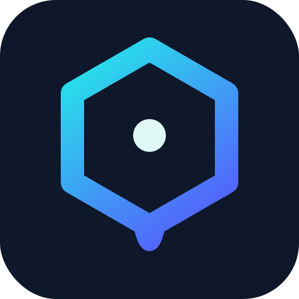

<!-- _class: lead -->
<!-- _paginate: false -->



# Compliance as Architecture

## How one small Go repo stays up to code across many geographies, regulations, and standards

<br>

<span class="tagline">web-researcher-mcp — your AI research assistant that cites real sources and stays honest.</span>

<div class="pills">
<span class="pill cyan">Trusted Sources</span>
<span class="pill">Real Citations</span>
<span class="pill">Private</span>
<span class="pill indigo">Open Source</span>
</div>

`↳ MIT licensed · every claim in this deck links to a file in the repo`

---

<!-- _class: thesis -->
<!-- _paginate: false -->

> You don't comply with 20-plus standards by doing 20-plus checklists.
>
> You comply by building **a few architectural properties** that satisfy the
> shared requirements underneath all of them — then you let **tests** prove it
> stays true.

---

<!-- _class: wm -->

# The setup: an unusual threat surface

A tool that **searches the web and reads arbitrary pages on your behalf**
inherits a threat model most apps never face.

| Threat | Severity | Why it's ours specifically |
|--------|----------|----------------------------|
| SSRF (Server-Side Request Forgery) | Critical | We fetch URLs — we *are* an SSRF cannon by default |
| Prompt injection via scraped content | High | Scraped bytes flow back into the model |
| Cost abuse via API-key theft | High | Every search costs money |
| Cross-tenant data leakage | High | One server, many users (HTTP mode) |
| Cloud-metadata credential theft | High | Scraping `169.254.169.254` = creds |
| Supply-chain compromise | Medium | A binary people run on their machines |

<!-- _footer: '↳ proof: docs/SECURITY_AND_COMPLIANCE.md → "What We Protect Against"' -->

---

<!-- _class: wm -->

# The constraint that makes it interesting

<br>

No compliance team. No budget for twenty separate audits.

Just a small open-source repo that still has to be **defensible to a hospital,
an EU regulator, and a US federal buyer** — at the same time.

<br>

## So how does that even work?

<!-- _footer: '↳ the rest of this deck is the answer' -->

---

<!-- _class: dense wm -->

# The standards wall

ISO 27001 · SOC 2 Type II · NIST CSF 2.0 · GDPR / UK GDPR · OWASP MCP Cheat
Sheet · OWASP Top 10 LLM (2025) · OWASP Agentic Top 10 (2026) · NIST AI RMF ·
EU AI Act · EU Cyber Resilience Act · NIS2 · FedRAMP · UK Cyber Essentials ·
UK NCSC CAF v4.0 · BSIMM · HIPAA · HITRUST CSF · FIRST PSIRT · MITRE ATT&CK ·
Global CBPR · IETF RFC 9700 / 9449 · CSA MCP Security Framework · NSA MCP
Security Guidance

<br>

## We did not write 23 checklists.

<!-- _footer: '↳ proof: docs/SECURITY_AND_COMPLIANCE.md → "Standards Alignment"' -->

---

<!-- _class: wm -->

# The convergence insight

Strip the labels, and the standards demand **the same handful of things**:

<div class="pillars">
<div class="pillar">

**Access control**
**Encryption** (rest + transit)
**Audit trail**

</div>
<div class="pillar">

**Data minimization**
**Tenant isolation**
**Supply-chain integrity**

</div>
<div class="pillar">

**Vulnerability handling**
**Transparency**

</div>
</div>

<br>

Map **once** to these primitives → inherit **many** regimes.
*HITRUST CSF alone maps to 40+ frameworks. That's the whole trick, formalized.*

<!-- _footer: '↳ proof: docs/SECURITY_AND_COMPLIANCE.md "Compliance Posture" · docs/SECURITY.md crosswalks' -->

---

<!-- _class: wm -->

# The architecture that does the satisfying

These primitives are **structural properties of the code**, not features:

- **Zero global state** — every dependency flows through one `tools.Dependencies` struct
- **Interface-driven** — `cache.Cache`, `search.Provider`, `audit.Auditor` swap without touching callers
- **One encryption layer** — AES-256-GCM at rest, reused everywhere sensitive data persists
- **One SSRF-safe client** — `scraper.NewSSRFSafeClient()` for *all* outbound fetches
- **Audit on every tool call** — async, structured, never blocks

> "Compliance through architecture, not bolt-on checklists."

<!-- _footer: '↳ proof: CLAUDE.md "Design Rules" · docs/SECURITY_AND_COMPLIANCE.md "Principles"' -->

---

<!-- _class: wm -->

# Lesson 1 — Secure by default, at every tier

The same architecture stays safe whether it runs on a laptop or in a shared
cluster. In **each** mode, the default is the safe one:

| Deployment | Default posture |
|------------|-----------------|
| **Local (STDIO)** | No listener, no attack surface — the calling process is the trust boundary |
| **Multi-tenant HTTP** *(ships today, enterprise networks)* | OAuth 2.1, per-tenant isolation, rate limits, encryption, audit — on by setting `PORT` |
| **Hosted service** *(if demand ever justifies it)* | Same controls, no rearchitecture — security was never bolted on "for the cloud" |

> **Secure by default, permissive by configuration** — power is unlocked by
> *explicit* choice, never the reverse.

<!-- _footer: '↳ proof: docs/SECURITY_AND_COMPLIANCE.md Principles 1 & 4, "Deployment Security"' -->

---

<!-- _class: wm -->

# Lesson 2 — AI tools have brand-new threat classes

Classic OWASP isn't enough. Two defenses worth their own slide:

**SSRF — for a scraper, the #1 risk**
Resolve DNS → validate **every** resolved IP against 19 CIDR blocks → connect to
the *pinned* IP (DNS-rebinding proof) → re-check on **every** redirect hop.

**Indirect prompt injection — scraped content is hostile input**
Sanitize (bluemonday allowlist), enforce size limits, mark content boundaries,
and signal `contentType` so the model knows these bytes are **untrusted**.

<!-- _footer: '↳ proof: internal/scraper/ssrf.go · docs/SECURITY_AND_COMPLIANCE.md "SSRF" & "Content Security"' -->

---

<!-- _class: wm -->

# Lesson 3 — Minimize by design, not by deferral

Privacy isn't "we haven't built the servers yet" — it's a structural choice that
holds **at every tier**:

- **No vendor telemetry, ever.** The project operates no analytics pipeline —
  in local *or* HTTP mode. Queries go straight to the provider *you* chose.
- **Content-addressed, not user-keyed.** The cache is keyed by query/URL hash;
  sessions are TTL-bounded and scoped to `{tenant}:{session}`.
- **The operator is the data controller.** In HTTP/hosted mode, data stays on
  *their* infrastructure — and minimization means there's little to hold.

> Less stored data → **less to erase**. Data-subject **access, portability, and
> erasure** (GDPR Art. 15/17/20) ship as admin-gated `GET`/`DELETE /admin/data`,
> backed by a pluggable `(tenantID, userID)` Exporter/Eraser registry that
> enumerates every personal-data namespace; TTL expiry and minimization mean
> there is little to hold in the first place.

<!-- _footer: '↳ proof: internal/datasubject · internal/server/server.go (/admin/data) · docs/SECURITY.md GDPR table' -->
<!-- Maintainer note: regenerate the derived compliance-deck.html / .pdf after editing this source. -->

---

<!-- _class: wm -->

# Lesson 4 — Tiered compliance: pay only for what you turn on

Compliance scales with **capability**, not all-at-once.

| Tier | Capability | Adds compliance for |
|------|-----------|---------------------|
| **1** | Search · scrape · extract (always on) | Baseline: SSRF, encryption, audit, minimization |
| **2** | Analytics & insights (opt-in) | GDPR legitimate interest, user-owned data |
| **3** | Content generation (opt-in) | EU AI Act Art. 50, China GenAI, Korea AI Act |
| **4** | Personalization (opt-in) | GDPR Art. 22, PIPL Art. 24, Quebec Law 25 |

Lower tiers **never** pay for higher-tier infrastructure. Compliance ships
**with** the feature — never "we'll add consent later."

<!-- _footer: '↳ proof: docs/SECURITY_AND_COMPLIANCE.md "Tiered compliance model"' -->

---

<!-- _class: wm -->

# Lesson 5 — Claims rot unless tests guard them

> "If documentation can be wrong without a test failing, it will eventually be
> wrong."

So CI **fails on doc drift**:

- `TestToolsDocMatchesRegistry` — docs must match the actual tool registry
- `TestOutputSchemaMatchesResponse` — schemas must match real responses
- `TestAllToolsHaveAnnotations` — every tool declares its read-only annotations

This turns compliance *claims* into compliance *facts*: **read the code, not the
marketing.**

<!-- _footer: '↳ proof: internal/tools/metadata_test.go · docs/LESSONS_LEARNED.md Lesson 5' -->

---

<!-- _class: wm -->

# Tool — Guardrails for humans *and* AI agents

Most code now arrives via an agent, so the rules apply to **Claude Code,
Copilot, Cursor** too:

- Never disable a security check to make a test pass — fix the cause
- Never `git commit --no-verify`
- Use `scraper.NewSSRFSafeClient()` — never `http.DefaultClient` for user URLs
- `subtle.ConstantTimeCompare` for secrets — never `==`
- Errors are values, never `panic()`

**Security-review triggers** (mandatory focused review): `internal/auth/`,
`scraper/ssrf.go`, cache-key generation, the `Dockerfile`, the CI pipeline.

<!-- _footer: '↳ proof: docs/SECURITY_AND_COMPLIANCE.md "Contributor" & "AI Agent Coding Rules" · CLAUDE.md' -->

---

<!-- _class: wm -->

# Tool — The automated gate

Rules nobody enforces are decoration. **One command is the gate:**

```bash
make verify   # fmt + vet + lint + gosec + govulncheck + race tests + e2e + build
```

Plus, continuously:

- **CodeQL** (security-extended) on every PR + weekly · **Dependabot** on deps
- **govulncheck + gosec + golangci-lint** pinned in `go.mod` → CI and local runs
  use *identical* versions
- **Network-free e2e security tests** — SSRF, blocked schemes, OAuth/scope gate —
  run on every PR with **no API keys**

<!-- _footer: '↳ proof: CLAUDE.md "Commands" · .github/workflows/ci.yml' -->

---

<!-- _class: wm -->

# Tool — Supply chain & vulnerability handling

**Every release ships:** cross-platform binaries · multi-arch Docker · SBOM
(SPDX) · **cosign signatures** · SHA-256 checksums.

**Every vulnerability follows the FIRST PSIRT lifecycle:**

Receive → Triage (CVSS v4.0 + CWE) → Remediate → Coordinated disclosure → Learn

<br>

This is what satisfies the **EU Cyber Resilience Act**, **NIS2**, and the
supply-chain clauses of nearly everything else — by construction, not paperwork.

<!-- _footer: '↳ proof: docs/SECURITY_AND_COMPLIANCE.md "Supply Chain" & "Vulnerability Management" · release.yml' -->

---

<!-- _class: wm -->

# What transfers to any project

1. **Map standards to primitives, not checklists** — satisfy many at once.
2. **Make the default the safe one** — gate power behind explicit config.
3. **Let compliance scale with features** (tiers), not with a big-bang program.
4. **Encode rules as constraints, then enforce them in CI** — including for AI agents.
5. **If a doc can be wrong without a test failing, it will be** — so test it.

<!-- _footer: '↳ five portable principles, no framework required' -->

---

<!-- _class: thesis -->
<!-- _paginate: false -->

# Read the code, not the marketing.

Every claim in this deck links to a file in the repo.

<br>

**One-stop:** `docs/SECURITY_AND_COMPLIANCE.md`
**Deep technical:** `docs/SECURITY.md`
**Privacy:** `docs/PRIVACY.md`

`github.com/zoharbabin/web-researcher-mcp · MIT`
